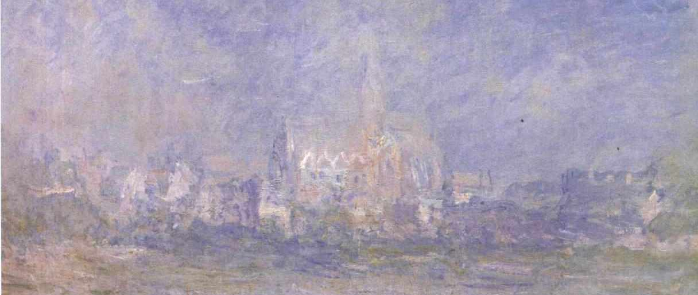

class: title, smokescreen, shelf, no-footer
background-image: url(steven-wei-yfgkWX-2vEA-unsplash.jpg)

--
# Realism and Perspective
### From Renaissance Painting to Digital Media September 29, 2021

---

# Signifying Realism

What are the conventions of realism?  

---

# Realism

* A key tenet:  “the realist image depicts something as if it would be seen by the human eye.”  The goal is to produce reality “as it is.”

--

* “a **set of conventions** or a **style of art or representation** that is understood at a given historical moment to accurately represent nature or the real or to convey and interpret accurate or universal meanings about people, objects, and events in the world.”  

--

Realism is historical.  

--

What is considered “realistic” or “realism” is historical, historically shifting, and based on convention and deeply tied to naturalized worldviews about knowledge and reality.

---
class: compact, col-2

# Renaissance Realism

* use of perspective to render spatial depth

* represented figures and their relative size both proportionally and accurately

* employed compositional techniques &amp; conventions for symmetry/balance

* often depicted Biblical scenes and narratives set in real/recognizable spaces and architectures 

 <caption><small>Pietro Perugino, _Christ Handing the Keys to St. Peter,_ 1481-1482</small</caption>

???
Note the illusionistic sense of three-dimensional depth on a two-dimensional surface created by Perugino’s use of single-point perspective

---
class: center

<iframe width="80%" height="80%" src="https://www.youtube.com/embed/cGYZ5847FiI" frameborder="0" allow="accelerometer; autoplay; encrypted-media; gyroscope; picture-in-picture" allowfullscreen></iframe>

<small>Dziga Vertov,  Man with a Movie Camera (1929)</small>

???
despite its fragmented, prismatic, non narrative style — it focuses on snapshots  of soviet life from dawn to dusk

---
class: col-2, compact, fit-h1

# Socialist Realism - Stalin’s mandate, 1930s&colon; “Art for the People”

 <small>Increase the Productivity of Labor (1927) Artist: Yuri Pimenov</small>

 <small>Vasilii Yefanov, _Stalin and Molotov with Children_ (1939)<small>

???
* Constructivism and other avant-garde movements were forcibly replaced by Socialist Realism under Stalin (c. 1930s) as the official style of political art
* art designed to promote nationalism and support for Soviet ideology.
* “Official Style” of the Soviet Union from 1932-1988
* pictorial realism — **against abstract** — art for the people
* Return to naturalistic representation
* Depictions of heroic political figures, everyday laborers, significant events in the history of the Russian Revolution, and scenes of imagined everyday working life
* Propaganda. Glorification of communist values and ways of life under communism

---
class: center compact
# Poetic Realism

<video width="70%" height="70%" controls>
  <source src="https://trailers.mubicdn.net/683/t-children-o_fr_en_800_640x496_50_683.m4v" type="video/mp4">
Your browser does not support the video tag.
</video>

<small>Marcel Carne’s _Children of Paradise_ (1945)</small>

???
Here the term realism refers to the fact that films made in this style tended to dramatize the social conditions of the French working class, mostly through fictional stories featuring tragic antiheroes.   Director Marcel Carné and screenwriter Jacques Prévert resurrect the tumultuous world of nineteenth-century Paris, teeming with hucksters and aristocrats, thieves and courtesans, pimps and seers.

---
class: center compact
# Italian Neorealism

<iframe width="70%" height="70%" src="https://www.youtube.com/embed/njLcOqW7xV0?start=243" frameborder="0" allow="accelerometer; autoplay; encrypted-media; gyroscope; picture-in-picture" allowfullscreen></iframe>

<small>Vittorio De Sica’s _The Bicycle Thieves_ (1948)</small>

???
shot on grainy black and white stock, reminiscent of WWII-era newsreels

---
class: col-2, compact

# Renaissance Realism: [Linear Perspective](https://www.youtube-nocookie.com/embed/bkNMM8uiMww)

 <caption><small>Sandro Botticelli, _Cestello Annunciation_ (1489)
</small></caption>
<small>
* Codified by Renaissance thinkers like Filippo Brunelleschi &amp; Leon Battista Alberti (early 1400s)
* Brunelleschi: image as a mirror or frame through which to view the world
* Use of instruments, mathematical calculation &amp; measurement for precise depiction of space &amp; form
* Thought of these rules as rational &amp; derived from nature itself
* Centering of the human observer/spectator, at the same time a sort of “replacement” of the seeing eye with mathematical techniques and instrumentation (152)
* “The Renaissance era embraced the idea that it is art’s social function to reproduce human vision through drawing instruments designed to replicate vision” (155)
</small>

---
class: compact
 <caption><small>Albrecht Dürer, _Draughtsman Making a Perspective Drawing of a Reclining Woman_ (~1600)</caption></small>

--
* Method — mathematization of space
--

* Metaphor — produces a singular subject position (Cartesian subject) &rarr; one point in space, not fragmented nor fragmentary 

???
note the gendering of this gaze, the reclined female

---
class: col-2, compact

# episteme

Michel Foucault's concept

* “the way an inquiry into truth and the real is organized in a given era.  An episteme is an accepted, dominant mode of acquiring and organizing knowledge in a given historical period” (S&amp;K, 147)
* From the word “epistemology,” the branch of philosophy concerned with knowledge
* The use and development of perspectival techniques in the Renaissance reflect the embrace of science and rationalism central to that era’s episteme.

> “The question for us is **not** which approach to realism has resulted in the most accurate representations of the world at any given time, but what do the different approaches to realism that we find in art and visual culture tell us about the culture and politics of a given social context.”

><cite>&mdash; Sturken &amp; Cartwright</cite>

???
episteme - a different way of ordering things, or the relation between words and things, the seeable and the sayable.  different ways of organizing and representing knowledge about things.

---
class: col-2

# Bonus: bizarre historical play with perspective

While most of the canvas is meticulously rendered in linear perspective, there’s a skull--a memento mori--painted in anamorphic perspective that projects in from the bottom.  It can only be seen correctly from one particular angle.

It’s also full of [layered symbolic meaning](https://www.youtube.com/watch?v=JFGSb1XVWes).

 <caption><small>Hans Holbein the Younger, _The Ambassadors_ (1533)</caption></small>

---
class: compact

# Challenges to Perspectival realism as a representational convention

* Emergence of alternative representational paradigms that reflected changing ideas about knowledge and human subjects, priorities in modes of representation, worldviews, for example:

  * **Impressionism** (end of the 1800s): defying perspective through emphasis on the artist’s “impression” of a scene, particularly the rendering of light and shadow through visible brushstrokes
  * **Cubism** (1910s-30s): rendering many views, perspectives simultaneously
  * **Abstract Expressionism** (1950s-60s): reflecting / expressing the artist’s embodied activity in making the work, gesture, spontaneity  

* Overall:  in the late modern period (late 1800s-1960s) there is a “questioning the representational traditions organized around the model of the Cartesian subject as the fixed center of the pictorial world”

---
class: img-caption

## Impressionism

Claude Monet, _Vétheuil in the Fog_, 1879

---
class: img-right-full

# Cubism

Marcel Duchamp _Nude Descending a Staircase (no. 2)_ (1912)

---
class: img-left-full

# Abstract Expressionism

Willem de Kooning, _Woman I_ (1950-52)

---
class: compact

# Main Points

### ...on perspective and realism from 500-odd years of art history

1. Realism and its representational codes are historically contextual, have engaged different meanings, styles, and techniques in different periods/places.

--

1. The history of representation is not a history of the refinement of techniques/technologies for accurately representing reality.

--

1. The history of representation is a history of representational codes, reflecting different, shifting, and sometimes competing worldviews, norms  and dominant ideologies.

--

1. Images are always more than simple windows onto the world; they are structured by codes and conventions, have agency.

---
class: roomy
# Perspective and Realism Today?

--
* Reality TV  
* _[Insert Social Media Platform Here]_ Live  
* Video Games

---
# For Friday's discussion sections:

* Watch videos embedded in today's slides

---  

#### _Enjoy fall break!!_

---  

# For Wednesday's Midterm Review:

* Re-read assigned readings, distilling main points
* Keywords