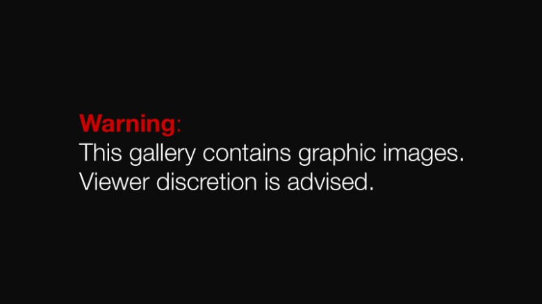
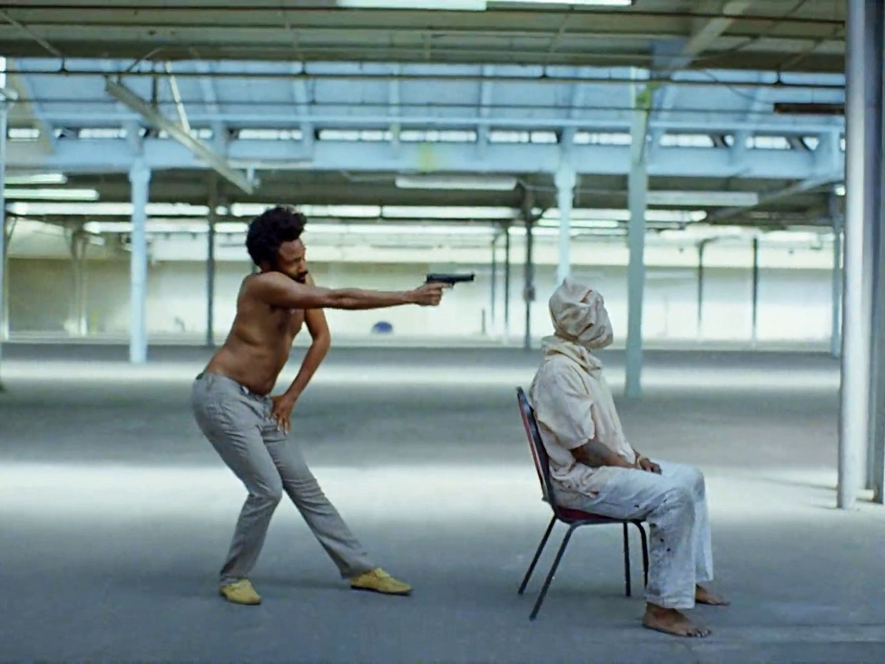

# Images, Power, and Politics
## Part 1
   
August 30, 2018

---

**Intertextuality**
: The referencing of one text _(or image)_ within another.  In popular culture, intertextuality refers to the incorporation of one text within another in a reflexive fashion.  

    Intertextual references assume that the viewer knows the people, events, and/or cultural products being referenced.

---

## Intertextuality in "This is America"

https://www.thisisinsider.com/this-is-america-music-video-meaning-references-childish-gambino-donald-glover-2018-5

--- 

> How do you look?

---

How do you appear (to others/to yourself)?   
_Do_ you appear (in/visibility)?   
How do you see?   
_Do_ you see? 

---

## Images Address Us

1. Modes of Address:  
    * Invitation
    * Command
    * Prohibition
2. Target of Address:  
    * Who is this "Us"?  
    * Subject Positioning

---

---

# Representation

mimesis vs. construction

--- 

## Mimesis

* representations imitate the real/material world
* "mirror" - reflecting back
* photography as "capturing the moment"

---

---

## Construction

* Mirrors don't reflect back faithfully; they distort
* The "gap" between the representation and the thing represented matters
* photography as <a href="http://www.iwojima.com/raising/raisingb.htm">framing reality</a>

---

## Indeterminacy

 

---

---
## Polysemy 

---

## "Seeing That" vs "Seeing As"
Wittgenstein 

---

### Kanizsa Triangle

---

### Representation ≠ Simulation {} ? {}

---

**For Friday:**
: Quiz #1
  

**For Tuesday:**
:  _Practices of Looking_, Chapter 1 (pp. 29 - 49) 
