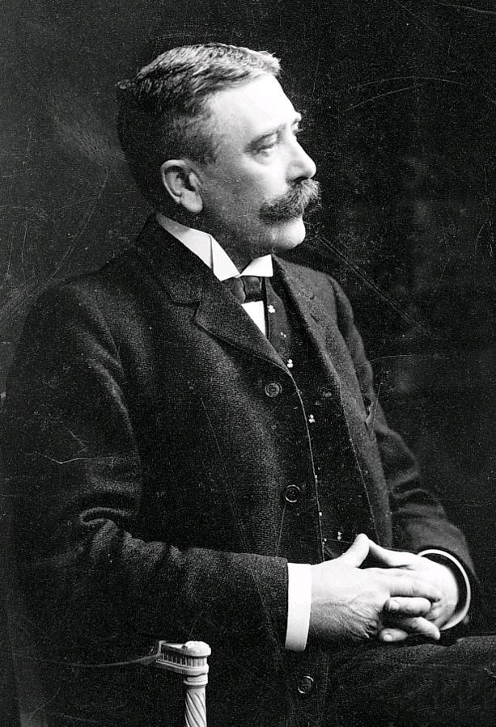
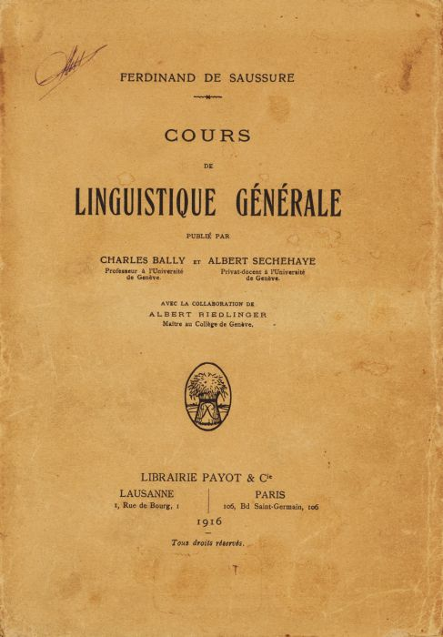
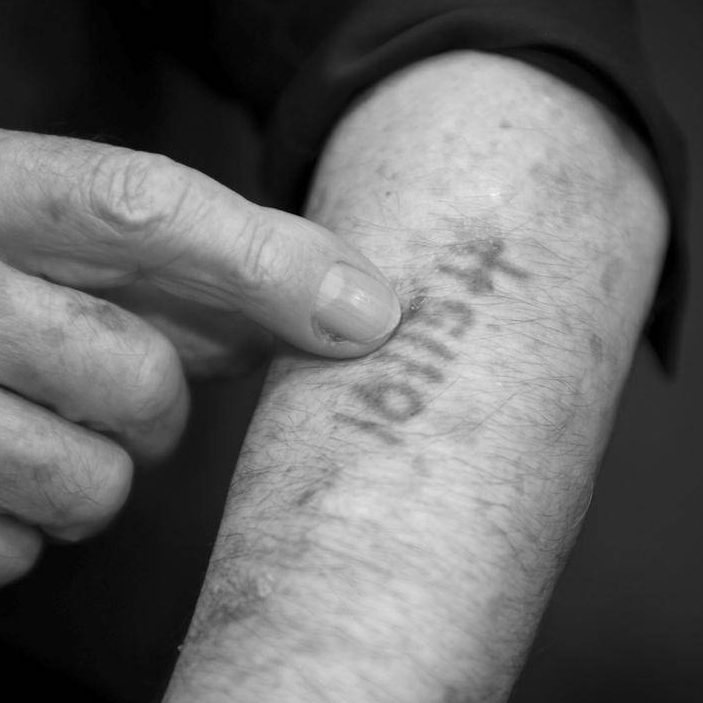
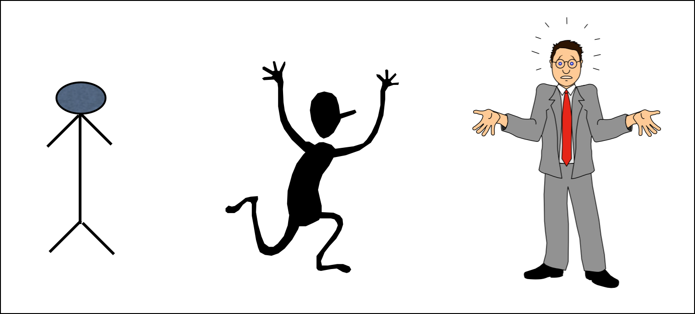

# Images, Power, and Politics
## Part 2
   
September 4, 2018

---

## Keywords Review

* Culture
* Representation
    * Mimesis vs. Construction
    * vs. Simulation
* Intertextuality
* Indeterminacy
* Polysemy

---

# Ekphrasis

---

## An Exercise in Ekphrasis

---


---



---

The meaning of an image is:

* contextual
* polysemic
* contested

---

# Semiotics

---

**Ferdinand de Saussure**  
20th Century French Linguist

<columns>
<column></column>
<column></column>
<columns>

---



---

### The Signifier (Sr)  

* The _physical form_ of the sign.
    * pencil marks
    * vocal sounds
    * pixels on a screen  
* The part of the sign that we perceive with our senses.

---


## SNOW

---


### The Signified (Sd)  

* The Signified is not the REFERENT (the “Thing Itself”)  
* Instead, the signified is the thought, concept, or mental image we may have of the referent.  
* The signified is attached to or “conjured up” by the signifier.

---



---



---

Tattoos and Semiotics

<columns>
<column></column>
<column></column>
<column></column>
</columns>

---

*  We can call physical marks by the name “signifier” _only when and if_ they conjure a signified to form a sign.

* If they don’t, then they are NOT signifiers.

---

### Is this a signifier?

{} It is if it conjures a mental concept (signified), such as: {}

{} * A map to my apartment. {}

{} * A woman reclining on a chair {}

---

### A Quick Game of
# PICTIONARY©

---

* Pictionary is the joint struggle to create a sign, such that the marks you make on the page become a signifier that “conjures up” the appropriate signified in the mind of your partner.  

* You may just end up making marks on the page that never become signifiers…

e.g. WHAT THE _*&%!!#_ ARE YOU DRAWING??!!??

---

Signs are:

* Abstract
* Arbitrary *and* Conventional
* Ambiguous

---

## Signs are NOT the concrete things that they represent…

--- 

#### There is no _necessary_ relationship between the signifier and the signified.

{} * For example, there is no reason why we use “d” “o” “g” to refer to that cute fuzzy thing that’s yapping at the door.   {}

{} * Instead, we use “dog” because of our CONVENTIONS... {}

---

Charles Sanders Peirce developed a schema for understanding the different ways a sign can relate to its referent, asking:

>How _MOTIVATED_ is the sign by the ‘thing itself’?

---

## Degrees of Motivation
#### (A continuum)  

* Symbol
* Icon
* Index

---

## Symbol

* _**LOW**_ Degree of Motivation
* The relationship between the sign and its referent is completely ARBITRARY or based on SOCIAL CONVENTION.  

{} Ex. The word “Spoon” or . . .  {}

---



---

## Icon

* _**MODERATE**_ Degree of Motivation
* A sign which RESEMBLES or LOOKS LIKE its referent.  

{}   {}

---

[“Sad and Useless Things I Have Drawn”](https://www.sadanduseless.com/things-i-have-drawn/)

---

## Index

* _**HIGH**_ Degree of Motivation
* A sign that is PHYSICALLY PRODUCED by its referent.  
* Examples:
    * Smoke is an index of fire
    * Sneezing is an index of a cold
    * A fingerprint is an index of a thief

---

What about a photograph?   
Like this image of Saussure?

---

## For next class:

* Read:  Selections from Barthes' Camera Lucida

* As you encounter the images in the assigned NYT article, note an image or two that engage your understanding of Barthes' concepts of _studium_ and _punctum_.   