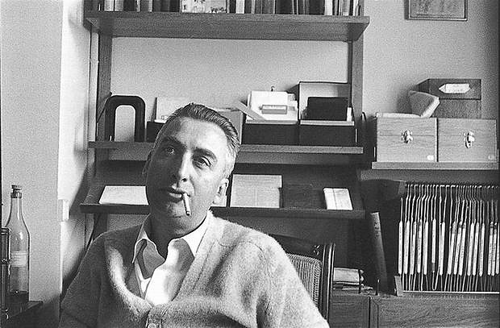

## Semiotics, cont’d

---



---



---

## Barthes' Contribution to Semiotics  

* Denotation
* Connotation
* Myth

---

## Semiotics Key Terms

* Dyadic Structure of a Sign (Saussure): Signifier / Signified
  

<ul>
<li>Continuum of “Motivation” (Peirce)
    <ul>
        <li>Symbol</li>
        <li>Icon</li>
        <li>Index</li>
    </ul>
</li>
</ul>

<ul>
<li>Levels of Signification (Barthes)
    <ul>
        <li>Denotation</li>
        <li>Connotation</li>
        <li>Myth</li>
    </ul>
    </li>
</ul>

---

# What Do Photographs Do?
## _Studium_ and _Punctum_

September 6, 2018

---

> "A photograph made me pause."

 – Roland Barthes, _Camera Lucida_

---

## Barthes’ Question:  
### _What Is Photography?_

[ An ontological question ]

---

### Difficulty in 
Seeing Photography

> “A specific photograph, in effect, is never distinguished from its referent . . . or at least it is not immediately . . . it is not impossible to perceive the photographic signifier (certain professionals do so), but it requires . . . reflection.” (p. 5)

---

> “Whatever it grants to vision and whatever its manner, a photograph is always invisible.  It is not it that we see.” (p. 6)

---

### Photography is _deictic_  

* A photograph “points a finger” (p. 6) 
* A photograph is _“here, now”_ but it always points to _“what was there, then”_
* “Look” “See” “Here it is”

---

## studium
## punctum

---

### studium  

* an affective relationship to the photograph characterized by “general and . . . _polite interest_,” the order of “liking”
* focus on the informational character of photography:  what did the photographer (“operator”) intend to convey?
* apprehended “in reverse”, as spectator

---

### punctum  

* “this element which rises from the scene, shoots out of it like an arrow, and pierces me” (p. 26)
* Latin word: wound, prick, or mark made by a pointed instrument
* “that accident which pricks me” (p. 27)
* NOT the result of analysis:  “In order to perceive the punctum, no analysis would be of any use to me” (p. 42)

---

>“ . . . in order to see a photograph well, it is best to look away or close your eyes.” 

 – Roland Barthes

---



---
