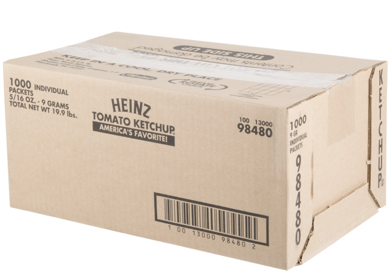
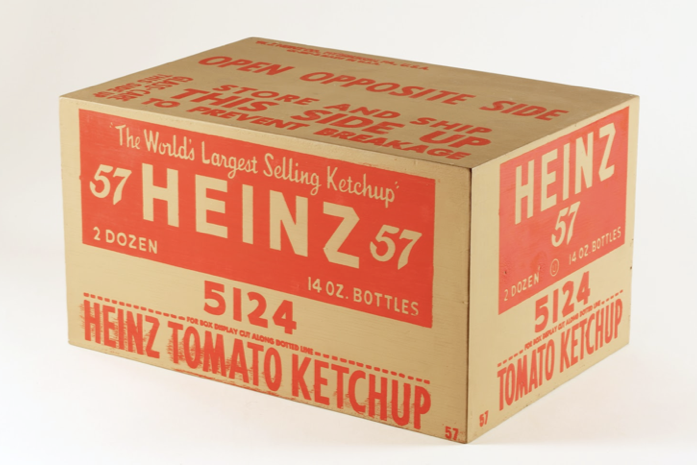
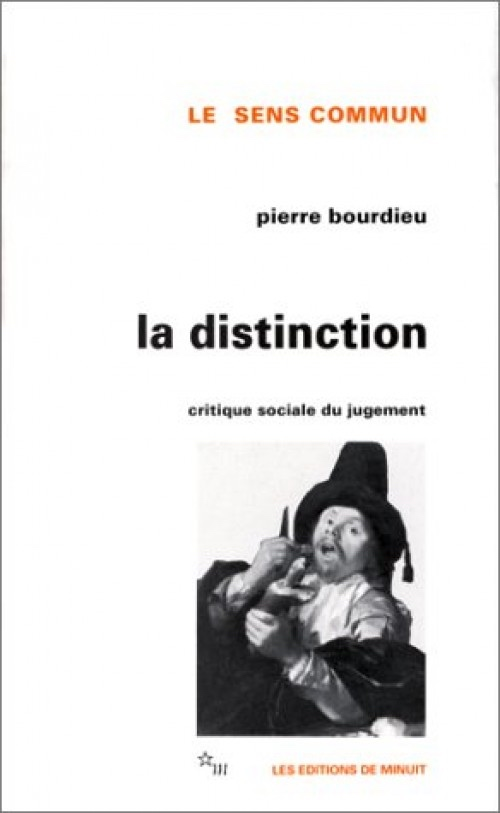
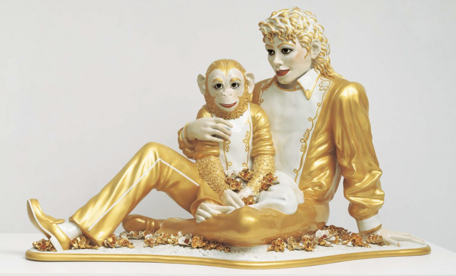

# Viewers Make Meaning
## Part 1

September 11, 2018

---

Where does the meaning and/or value of an image lie?

---

Is it _intrinsic_ or _inherent_ to the image itself?

---

Does it come from the creator's intention?

---

## Production of Meaning

* Image
* Producer
* **Codes and Conventions**
* **Viewers and their Experiences**
* **Viewing Context**

---



# `Codes`

{}
What are the codes that structure a Calvin Klein ad?
{}

---



---



---



---



---



---



---

## Syntagm and Paradigm

---

**syntagm**
: syntagmatic relationships are about **positioning**, the _syntax_ of a sentence or an image

_"John ate an octopus."_   ≠  _"An octopus ate John."_

---

**paradigm**
: paradigmatic relationships are about **substitution**

---

Discuss:  How do the paradigmatic and syntagmatic axes relate to an advertising campaign?  To culture jamming?

---



---

## Viewer Experience

---

Kundel HL, Nodine CF. “A visual concept shapes image perception.” _Radiology_ 1983; 146:363–368. 

---



{}
sonogram of abdomen

dilated common bile duct with large eye carcinoma at the head of the pancreas
{}

---



{}
A & C expert vision

B & D non expert vision
{}

---



---



---

## Viewing Context

---



## Viewing Context

---

Andy Warhol, Heinz Ketchup, 1964

---

## Aesthetic Judgement
### ("taste")

---

Taste as _"cultivated"_ 

---

## Connoisseurship

---

Norman Rockwell   
"The Connoisseur," 1961.

---

Pierre Bourdieu  
_Distinction:  A Social Critique of the Judgement of Taste_ (1979 / 1984).

explores relationship between class and taste and between economic class and social capital

---

According to Bourdieu, judgements of taste express a class-based **habitus**, and are one of the defining elements of social identity.

><small>"Nothing more clearly affirms one's 'class', nothing more infallibly classifies, than tastes in music...there is no more 'classificatory' practice than concert-going, or playing a 'noble' instrument." (Bourdieu, 1979, Distinction, p. 18).</small>

---



{}
Thomas Kinkade, The Forest Chapel  (1999)
{}

---



{}
Kazimir Malevich, Black Square (1913)
{}

---

## kitsch

{}

Some theories about the origin of "kitsch"

* word emerged in the art markets of Munich in the 1860s and 1870s, describing cheap, popular, and marketable pictures and sketches
* From the dialect German word, _kitschen_ - to smear
* From the German verb _verkitschen_ - to cheapen
* A mispronunciation of the English word _sketch_, or an inversion of the French _chic_ (fashionable)

{}

---



{}
Knick-knacks on the shelf at a dollar store
{}

---

<small>**Hand Painted Porcelain, 1950s** $60 on Etsy</small>

---
### Recoding Kitsch as Art

<small>_Michael Jackson and Bubbles_ 
Jeff Koons, Banality series, 1988</small>

{}
originally priced at $250,000 in 1988, it sold for a record $5.6 million in 2001 to Norwegian collector Hans Rasmus Astrup
{}

---



