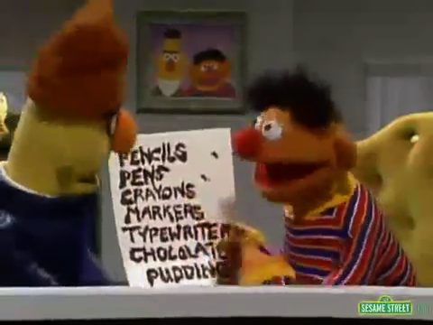

# The Politics of Authorship

September 20, 2018

---

## Paper Advice

1.  _Italicize_ the titles of artworks and be consistent with your use of these titles.
2. Double-check to ensure that you're using the correct spelling of all artist names!
3. Include your own name at the start of your paper, along with a title and date.
4. Number your pages!
5.  Include your first and last name when giving your Word document a name:  `lastName_firstName_paper1.docx`

---



{}
Does anyone get the irony of this slide?
{}

---



{}
At your tables, discuss:  what is the main point of each article?
{}

---

### Review:  Hall's Three "Decoding Positions"

1. **Dominant / Hegemonic**:  The "Preferred Reading" or interpretation.

2. **Negotiated**:  A Negotiated Reading   
    Accepting some of preferred reading, rejecting or ignoring other parts

3. **Oppositional / Counter-Hegemonic**:   
    A “Globally Contrary” or Oppositional Reading

--- 

Discuss:   

---

Here are the rest of the slides I showed today, as PDF:

[2018-09-20rest_of_slides.pdf](2018-09-20rest_of_slides.pdf)