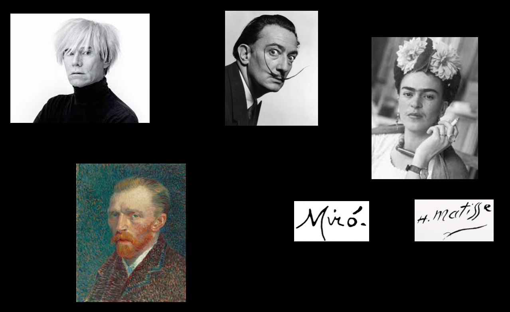
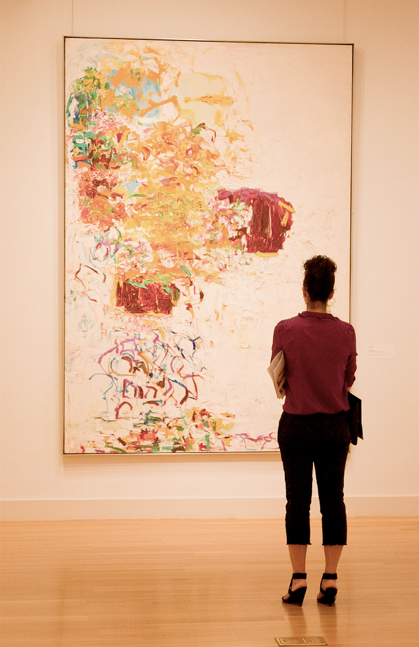

# The Politics of Authorship

September 20, 2018

---

## Paper Advice

1.  _Italicize_ the titles of artworks and be consistent with your use of these titles.
2. Double-check to ensure that you're using the correct spelling of all artist names!
3. Include your own name at the start of your paper, along with a title and date.
4. Number your pages!
5.  Include your first and last name when giving your Word document a name:  `lastName_firstName_paper1.docx`

---



{}
Does anyone get the irony of this slide?
{}

---



{}
At your tables, discuss:  what is the main point of each article?
{}

---

Discuss:

* Main point(s)
* What is at stake?

---



<small style="color:white;">“The author is a modern figure, a product of our society insofar as . . . it discovered the prestige of the individual.” [Barthes, "The Death of the Author." (142)]</small>

---

><small>“To give a text an Author is to impose a limit on that text, to furnish it with a final signified, to close the writing. Such a conception suits criticism very well, the latter then allotting itself the important task of discovering the Author (or its hypostases: society, history, psyche, liberty) beneath the work: when the Author has been found, the text is 'explained' - victory to the critic.”</small>

<small>Barthes, "The Death of the Author." (147)</small>

---

“every text is eternally written here and now.”

“the true place of the writing . . . is reading”

“...a text's unity lies not in its origin but in its destination.”

---

### What kinds of discourse do we attribute to an Author?

---



---

### Response to / Critique of Barthes
>“It is not enough . . . to repeat the empty affirmation that the author has disappeared. . .   Instead, we must locate the space left empty by the author's disappearance, follow the distribution of gaps and breaches, and watch for the openings its disappearance uncovers.” [Foucault, "What Is An Author?" (209)]

---

## Foucault:  _Author Function_

---

Author Function: **Four Characteristics**

1. Linked to the **juridical** and **institutional** system that encompasses, determines, and articulates the universe of discourses.
1. Does not affect all discourses in the same way at all times and in all types of civilizations
1. Defined by _specific and complex operations_.
1. It does not refer simply to a real individual, since it can give rise simultaneously to different selves, to several subjects – _positions_ that can be occupied by different classes of individuals.

---

---

### Review:  Hall's Three "Decoding Positions"

1. **Dominant / Hegemonic**:  The "Preferred Reading" or interpretation.

2. **Negotiated**:  A Negotiated Reading   
    Accepting some of preferred reading, rejecting or ignoring other parts

3. **Oppositional / Counter-Hegemonic**:   
    A “Globally Contrary” or Oppositional Reading

--- 

Discuss:   

---

Here are the rest of the slides I showed today, as PDF:

[2018-09-20rest_of_slides.pdf](2018-09-20rest_of_slides.pdf)