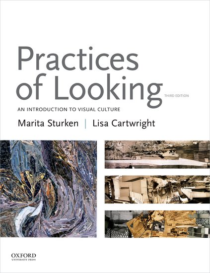

class: title, smokescreen, shelf, no-footer
background-image: url(nathan-anderson-99542-unsplash.jpg)

# VMS 202D
### Introduction to Visual Culture August 28, 2018

---
class: title

## Welcome and Introductions

---
class: img-right-full

# Course Mechanics

---

class: img-left-full

# Course Mechanics

* ## Course Website
https://mjvo.github.io/vms202d   

---
class: img-left

# Course Mechanics

* ## Textbook
_Practices of Looking_ (3rd Edition) 
   
---

**Culture**
: *"the shared practices of a group, com­munity, or society, through which meaning is made out of the visual, aural, and textual world of representations."*

---
background-image: url(visual_culture.png)

---



---

## For Thursday

Read:
: *Practices of Looking*, Chapter 1 (pp. 1 - 29)