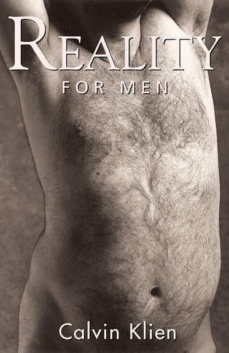
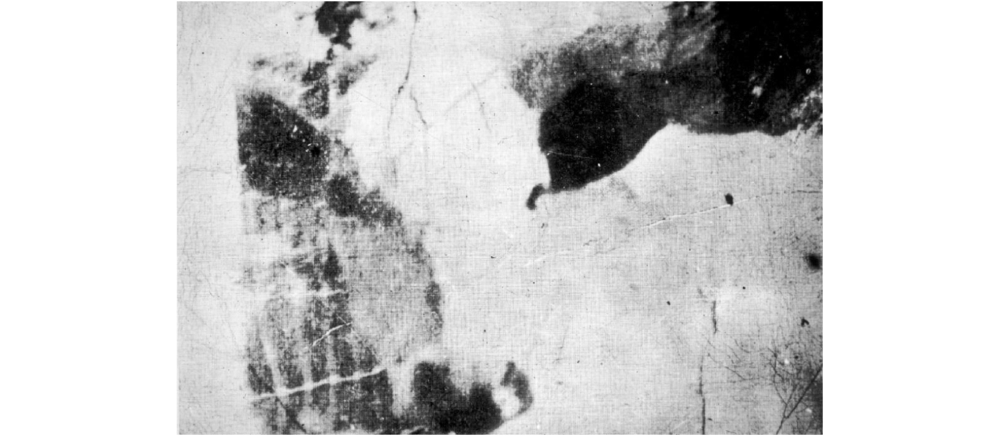
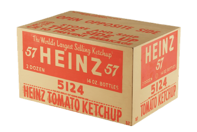
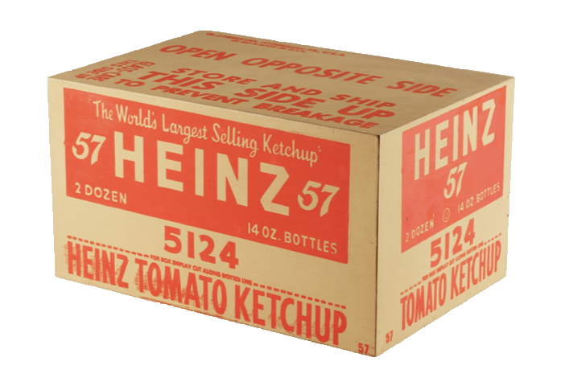

class: title, smokescreen
background-image: url(sharpiegate.jpg)


# #sharpiegate

---

background-image: url(sharpiegate.jpg)


---
class: title

## [https://twitter.com/hashtag/TrumpSharpie](https://twitter.com/hashtag/TrumpSharpie)

---
class: title, smokescreen, shelf, no-footer
background-image: url(warhol_heinz.png)

# Viewers Make Meaning
### Part 1: Codes, Viewers, Contexts<br>September 9, 2019

---

<br><br><br><br>
> Where does the meaning and/or value of an image lie?

---
class: img-right
# Intrinsic


Is it _intrinsic_ or _inherent_ to the image itself?


---
class: img-left
# Intention


Does it rely on the creator's intention?

---
class: img-right
# Production of Meaning


* Intrinsic to the Image<br><br>
* Producer's Intention<br><br>
--

* **Codes and Conventions**<br><br>
--

* **Viewers and their Experiences**<br><br>
--

* **Viewing Context**

---
class: img-caption


What are the codes that structure a Calvin Klein ad?

---
class: center


---
class: img-left
<br> 

--


---
class: center


---
class: center



---
class: center


---
# Syntagm and Paradigm

---
# Syntagm

* Syntagms define a sequential "grammar" to signs:<br><br>`subject-verb-object` or `this and this and this`<br><br>
* Syntagmatic relationships are about **positioning**, the _syntax_ of a sentence or an image.

_"John ate an octopus."_   ≠  _"An octopus ate John."_

---
class: col-2
# Syntagm

Poets and artists and ad execs play with the syntagmatic grammar of visual and textual signs

```html
so much depends
upon

a red wheel
barrow

glazed with rain
water

beside the white
chickens

- William Carlos Williams
```

---
class: img-left-full, right


# Patrice Letarnec
## Head Walk (2014)

---
# Paradigm

* Paradigms refer to **sets** of signs that can be substituted for each other and still convey meaning.<br><br>
--

* Convention or logic indicates a _set_ of signs that "can" or "should" be substituted for each other:<br><br>
    _"John cooked **fish**."_ |  _"John cooked **corn**."_ | _"John **grilled** corn."_<br><br>

--

* Some paradigmatic substitutions render a collection of signs _poetic_ &mdash; 
--

`"The sun cooked the pavement."`
--

&mdash; or sometimes _meaningless_&colon;<br> 
--
`"John cooked semiotics furiously."`

---

Discuss&colon;<br>How do the paradigmatic and syntagmatic axes relate to an advertising campaign?  To culture jamming?

---
class: title
background-image: url(enjoy-capitalism.jpg)

---
class: center


---
class: title
## Viewer Experience

---
class: title

### Kundel HL, Nodine CF. (1983) “A visual concept shapes image perception.” _Radiology, 146:_ 363–368. 

---
class: img-caption

--
<q>sonogram of the abdomen, revealing dilated common bile duct with large eye carcinoma at the head of the pancreas</q>

---
class: title 

background-image: url(kundel_nodine1.png)

---
class: img-caption


--
Bos taurus<br>
--
(otherwise known as "a cow")
---
class: title 

background-image: url(kundel_nodine2.png)

---
class: title 

## Viewing Context

---
class: title, smokescreen 
background-image: url(chuttersnap-fyaTq-fIlro-unsplash.jpg)

--
# 

---
class: title 
background-image: url(r_-r-2_BZuGgkP4k-unsplash.jpg)

# 

---

## Andy Warhol
### _Heinz Ketchup,_ 1964<br>


---
class: title
## Aesthetic Judgement<br>("taste")

---

Taste as _"cultivated"_ 

---

## Connoisseurship

---
class: img-left


### Norman Rockwell<br>_The Connoisseur,_ 1961.

---
class: img-left


Pierre Bourdieu  
_Distinction:  A Social Critique of the Judgement of Taste_ (1979 / 1984).

Explores relationships between:
* economic class and taste<br><br>
* economic class and social capital

---

According to Bourdieu, judgements of taste express a class-based <span style="text-decoration:underline;">**habitus**</span>, and are one of the defining elements of social identity.

> <q>Nothing more clearly affirms one's 'class', nothing more infallibly classifies, than tastes in music...there is no more 'classificatory' practice than concert-going, or playing a 'noble' instrument.</q><br /><cite>&mdash; Bourdieu (1979) Distinction, p. 18</cite>
---
class: img-caption


Thomas Kinkade, _The Forest Chapel_  (1999)

---
class: title, center
<br>
Kazimir Malevich, Black Square (1913)

---
class: title

## kitsch

---

## Some theories about the origin of "kitsch"

* word emerged in the art markets of Munich in the 1860s and 1870s, describing cheap, popular, and marketable pictures and sketches<br><br>
--

* From the dialect German word, _kitschen_ - to smear<br><br>
--

* From the German verb _verkitschen_ - to cheapen<br><br>
--

* A mispronunciation of the English word _sketch_, or an inversion of the French _chic_ (fashionable)


---

<br>
Knick-knacks on the shelf at a dollar store


---

<br>
**Hand Painted Porcelain, 1950s**<br />$60 on Etsy

---
## Recoding Kitsch as Art

<br>_Michael Jackson and Bubbles_<br />
Jeff Koons, Banality series, 1988

---
class: img-left
## Recoding Kitsch as Art

<br><br>

<br><br>Originally priced at $250,000 in 1988, it sold for a record $5.6 million in 2001 to Norwegian collector Hans Rasmus Astrup

---
class: title 
background-image: url(koons_silver_bunny.png)

---
# For Wednesday

Read:

* Practices of Looking, Chapter 2 (pp. 74 – 88)<br><br>

* Stuart Hall, “Encoding / Decoding” (1980⁄2006) in Durham, M.G. & Kellner, D.M. _Media and Cultural Studies: KeyWorks._ Malden, MA: Blackwell Publishing. pp. 163-173.
