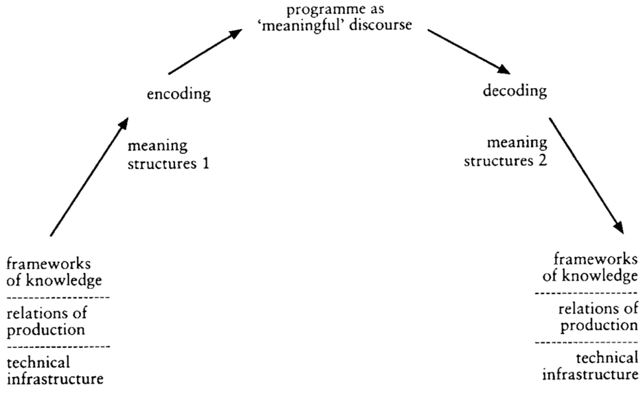

class: title, smokescreen, shelf, no-footer
background-image: url(interpellation_cover.jpg)

# Viewers Make Meaning
### Part 2: Ideology &amp; Encoding/Decoding September 11, 2019

---
class: img-left-full
# Review:

Barthes' notion of **_myth_**&colon;

--
* Connotations that function _ideologically;_ that is, meanings that are specific certain groups are made to seem natural, univeral, and given for a whole society.    

--
* Ideology as the _naturalization of the contingent._

---
class: roomy 

# Ideology:

* As the _naturalization of the contingent._ (Barthes)  

--

* As _propaganda_.  

--

* As _false consciousness_. (Marx) 

---
class: title

## Louis Althusser (1970) “Ideology and Ideological State Apparatuses”

---

## Ideology (Althusser):

--
* is "the imaginary relationship of individuals to their real conditions of existence"   

--
* "has a material existence" (e.g. ideology exists in/as an _apparatus_:  an institution, a power structure, and its practices.)  

--
* "hails or interpellates concrete individuals as concrete subjects." 

---

   
> "I shall then suggest that ideology 'acts' or 'functions' in such a way that it 'recruits' subjects among the individuals (it recruits them all), or 'transforms' the individuals into subjects (it transforms them all) by that very precise operation which I have called interpellation or hailing, and which can be imagined along the lines of the most commonplace everyday police (or other) hailing: 'Hey, you there!"

---
class: roomy
## Interpellation:

* "Hey you there"  
* Ideology interpellates the individual as a subject  
* Ideology  subjects,  its  function  is  to  subject,  to  unfold the  process  of  subjectivation.

---

background-image: url(i_want_you.png)

---
class: no-footer center
<iframe width="90%" height="90%" src="https://www.youtube.com/embed/KoknqliXxGQ" frameborder="0" allow="accelerometer; autoplay; encrypted-media; gyroscope; picture-in-picture" allowfullscreen></iframe>

---
class: title

# Encoding / Decoding
## Stuart Hall

---
class: roomy

## Stuart Hall

For Stuart Hall, the process of communication involves the articulation of linked but distinctive moments:

* production  
* circulation  
* distribution/consumption  
* reproduction  

---
class: center

<small>Shannon & Weaver, 1948 “A Mathematical Theory of Communication” _Bell System Technical Journal_</small>

---
# Reproduction?

>“Once accomplished, the discourse must then be translated– transformed, again – into social practices if the circuit is to be both completed and effective. If no “meaning” is taken, there can be no “consumption”. If the meaning is not articulated in practice, it has no effect.” (Stuart Hall)

---
class: center

<small>Hall's Visualization of Encoding / Decoding of Broadcast Media</small>

---
# Different "Decoding Positions"

1. **Dominant / Hegemonic**: The "Preferred Reading" or interpretation.  
--

2. **Negotiated**: A Negotiated Reading - Accepting some of preferred reading, rejecting or ignoring other parts.  
--

3. **Oppositional / Counter-Hegemonic**: A “Globally Contrary” or Oppositional Reading.

---

## Hegemony

Stuart Hall adopts this term from Italian philosopher Antonio Gramsci

* Dominant ideologies offered and experienced as _"common sense"_

* Dominant ideologies are locked in struggle with other "counter-hegemonic" forces so their dominance is never guaranteed.

---
# For Monday

Read:

* Barthes, Roland. (1967⁄1977). “Death of the Author.” in _Image-Music-Text_. London: Fontana Press. pp. 142-148.

* Foucault, Michel. (1969⁄1998). “What is an Author?” in _Aesthetics, Method, and Epistemology (Essential Works of Foucault, 1954-1984, Vol. 2)_. New York: The New Press. pp. 205-222.

!!! **Important**&colon; These are difficult readings.  Read 2 - 3 times.  Don't wait until Sunday evening!!
