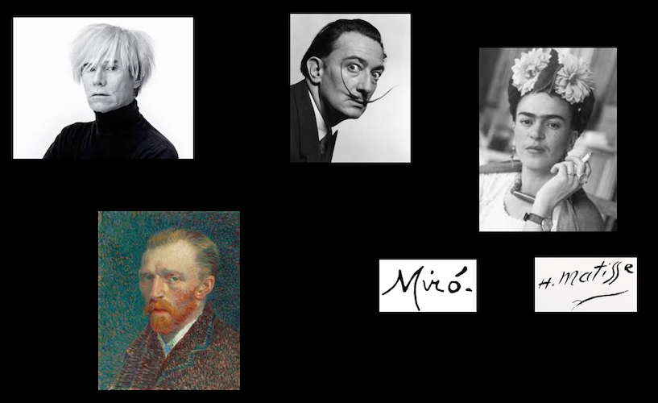

class: title, smokescreen, shelf, no-footer
background-image: url(aaron-burden-y02jEX_B0O0-unsplash.jpg)

# The Politics of Authorship
### Part 1: Barthes v. Foucault September 16, 2019

---
class: compact 
## Paper Advice

1. Include your own name at the start of your paper, along with a title and date.

    > Mark Olson 
    > Paper #1: Semiotic Analysis of a Virginia Slims Ad 
    > September 20, 2019

1. When defining key terms, use *both* direct quotation from the textbook (with proper citation) **and** explication in your own words.

1. Include your image!

1. Number your pages!

1. Name your Word document in this way:  `lastName_firstName_paper1.docx`

1. Email your Word document to both your professor and TA no later than the beginning of your discussion section on Friday.

---

## Review:  Hall's Three "Decoding Positions"

1. **Dominant / Hegemonic**:  The "Preferred Reading" or interpretation.

2. **Negotiated**:  A Negotiated Reading   
    Accepting some of preferred reading, rejecting or ignoring other parts

3. **Oppositional / Counter-Hegemonic**:   
    A “Globally Contrary” or Oppositional Reading

---
class: center
 <small>“The author is a modern figure, a product of our society insofar as . . . it discovered the prestige of the individual.” [Barthes, "The Death of the Author." (142)]</small>
---
class: img-caption

**"The Death of the Author"** Roland Barthes, 1967

---
class: img-right-full

      
**"What is an Author?"** 
Michel Foucault, 1967

---

class: roomy 
# Discuss:

* Main point(s)  
* What is at stake?  
* Examples in support of Barthes? of Foucault?

---
class: roomy
>“To give a text an Author is to impose a limit on that text, to furnish it with a final signified, to close the writing. Such a conception suits criticism very well, the latter then allotting itself the important task of discovering the Author (or its hypostases: society, history, psyche, liberty) beneath the work: when the Author has been found, the text is 'explained' &ndash; victory to the critic.”

><cite>&mdash; Barthes, "The Death of the Author." (147)</cite>

---
class: img-right-full

    
<q>every text is eternally written here and now.</q>

<q>the true place of the writing . . . is reading</q>

<q>...a text's unity lies not in its origin but in its destination.</q>

---
class: title
### What kinds of discourse do we attribute to an Author?

---
class: title
background-image: url(foucault_wordcloud.jpg)

---

### Foucault's Response to / Critique of Barthes
>“It is not enough . . . to repeat the empty affirmation that the author has disappeared. . .   Instead, we must locate the space left empty by the author's disappearance, follow the distribution of gaps and breaches, and watch for the openings its disappearance uncovers.”

> &mdash; <cite>Foucault, "What Is An Author?" (209)</cite>

---
class: title

## Foucault:  _Author Function_

---

# Author Function: _Four Characteristics_
--

1. Linked to the **juridical** and **institutional** system that encompasses, determines, and articulates the universe of discourses.  
--

1. Does not affect all discourses in the same way at all times and in all types of civilizations  
--

1. Defined by _specific and complex operations_.  
--

1. It does not refer simply to a real individual, since it can give rise simultaneously to different selves, to several subjects – _positions_ that can be occupied by different classes of individuals.

---
class: roomy, col-3

# Juridical and Institutional System

 

---
class: center

...does not affect all discourses in the same way.

---
class: img-right-full

# The Author's Name

serves “a classificatory function. Such a name permits one to group together a certain number of texts, define them, differentiate them from and contrast them to others.”

---

class: fullbleed

---
class: roomy

The <q>author-function</q> is the result of a <q>complex operation</q> that <q>constructs a certain being of reason we call ‘author.’</q>

_The author can neutralize contradictions across different texts._

---
class: fullbleed

---
class: roomy

   
> In short, it is a matter of depriving the subject . . . of its role as originator, and of analyzing the subject as a variable and complex function of discourse.

><cite>&mdash; Michel Foucault</cite>
---
# For Wednesday

Read:

* Selection from Karl Marx's [early writings on "estranged labor"](https://sakai.duke.edu/access/content/group/4fbd6c02-a04b-4b1c-b29f-83e350cfb29c/Readings/marx-EstrangedLabour.pdf)  
* Graeber, David. (2013).  "[On the Phenomenon of Bullshit Jobs: A Work Rant.](http://www.strike.coop/bullshit-jobs/)" _Strike! Magazine_, Issue 3 "The Summer of	&hellip;"