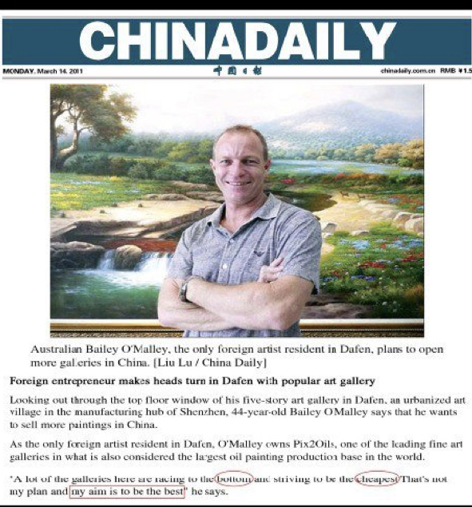

class: title, smokescreen, shelf, no-footer
background-image: url(1356881348_72427c834d_b.jpg)

# Visual Technologies, Reproduction, and the Copy, Part 1
###   October 16, 2019

---
class: img-caption no-footer

 
Addie Wagenknecht, _Black Hawk Paint_ (2008)

---
class: title

# The Original

--
## (in analog times)

---
class: title, smokescreen
background-image: url(alexander-sinn-bcSOuzNyigU-unsplash.png)

# The Original in the Digital Era

???
what happens to the original in the digital era?

---
class: img-right-full

# Nostalgia for the Analog

  _Mona Lego (Studs Up)_   
Eric Harshbarger, 2000

???
Fetishizing the analog in the age of the digital

---
class: img-caption

Nostalgia for the Analog

---
class: compact center

# Copy Culture

 
Dafen, China

---
class: compact center

# Mass Production

 
20 - 50 paintings per day

???
8 yuans per copy = $1.20   
2000 - 3000 yuans per month (roughly $300-$450)

DISCUSS Capitalism   
	
* exploitation? - van gogh specialist - factory production 50 paintings each day / yet freedom from factory work

* globalization - 
	* —> rise of moneyed classes in China — class habitus (Bourdieu) of creative labor (piano school)
	* —> Dutch bank, chinese & foreign clients, only invests US dollars - $100,000 minimum; Van Gogh as gift
	* —> US tourists
	* —> Visual culture of hotel chains
---
class: img-right
# Foreign Entrepreneurs

  
### pix2oils.com (on Facebook)

---
  

