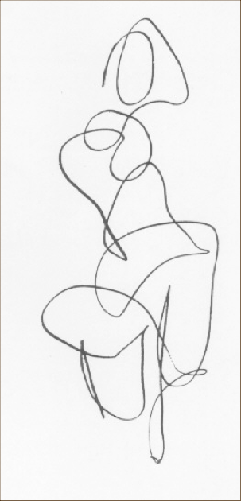

class: title, smokescreen, shelf, no-footer
background-image: url(austin-chan-ukzHlkoz1IE-unsplash.jpg)

# Images, Power, &amp; Politics
### Part 2 August 30, 2021

---
class: roomy
# Looking and Power

* The "right to look"
* Visibility: Power may be negotiated by making things visible
    * "Shining a light on injustice" 
    * Recognition and democracy
* Invisibility
    * Eluding surveillance
* Images themselves have power (to persuade, to inspire, to injure)

---
class: roomy
# Keywords Review

* Culture
* Representation
    * Mimetic
    * Constructed
* Myth of Photographic Truth
* Intertextuality
* Indeterminacy
* Polysemy

---
class: title 

# Ekphrasis

---
class: title smokescreen shelf
background-image: url(ballerinas.png)

# An Exercise in Ekphrasis

---
class: title
background-image: url(ballerinas.png)

---
class: title
background-image: url(play_dc_fountain.jpg)

???

Micaela Montelara plays in the fountain at Georgetown Waterfront Park during a heatwave in Washington, D.C. on August 13, 2021. Brendan Smialowski / AFP / Getty

---
class: roomy

The meaning of an image is:

* contextual  
--

* polysemic  
--

* contested

---
class: title 

# Semiotics

---
class: title
background-image: url(austin-chan-ukzHlkoz1IE-unsplash.jpg)

---
class: col-2 compact

# Ferdinand de Saussure  

---
class: title
background-image: url(what_is_sign.png)

---
class: col-2

# The Signifier (Sr)

* The _physical form_ of the sign.  
    * pencil marks  
    * vocal sounds  
    * pixels on a screen  
* The part of the sign that we perceive with our senses.      

---
class: col-2
background-image: url(snow.jpg)

--
## SNOW

--

---
# The Signified (Sd)  

* The Signified is not the REFERENT (the "Thing Itself")  
* Instead, the signified is the thought, concept, or mental image we may have of the referent.  
* The signified is attached to or “conjured up” by the signifier.

---
class:title
background-image: url(sign_not_referent.png)

---
class: center

# Wasp!!!!!!

---

class: roomy 

    

*  We can call physical marks by the name “signifier” _only when and if_ they conjure a signified to form a sign.

--

* If they don’t, then they are NOT signifiers.

---
class: img-left

### Is this a signifier?

--
It is, _**if**_ and only if, it conjures a mental concept (signified), such as:

--
* A map to my apartment.  

--
* A woman reclining on a chair.

---
class: title
# A Quick Game of PICTIONARY©

---
  

* Pictionary is the joint struggle to create a sign, such that the marks you make on the page become a signifier that “conjures up” the appropriate signified in the mind of your partner.  

--
* You may just end up making marks on the page that never become signifiers…

e.g. WHAT THE _*&%!!#_ ARE YOU DRAWING??!!??

---
class: col-2

## Signs are:

* Abstract  
--

* Arbitrary *and* Conventional  
--

* Ambiguous

---
class: fit-h1
# Signs are NOT the concrete things that they represent…

--- 

--
#### There is no _necessary_ relationship between the signifier and the signified.

--
* For example, there is no reason why we use “d” “o” “g” to refer to that cute fuzzy thing that’s yapping at the door.  

--
* Instead, we use “dog” because of our CONVENTIONS... 

---

# Adrian Piper, Catalysis III & IV (1971)

Denotative vs Connotative Meaning (Barthes)

---

   
Charles Sanders Peirce developed a schema for understanding the different ways a sign can relate to its referent, asking:

>How _MOTIVATED_ is the sign by the 'thing itself'?

---
class: center 
# Degrees of Motivation

(A continuum)  

## Symbol &harr; Icon &harr; Index

---
class: col-2
# Symbol
--

* _**LOW**_ Degree of Motivation  
* The relationship between the sign and its referent is completely ARBITRARY or based on SOCIAL CONVENTION.

Ex. The word “Spoon” or . . .   

---
class: compact
# Icon
--

* _**MODERATE**_ Degree of Motivation  
* A sign which RESEMBLES or LOOKS LIKE its referent.

--

---
class: col-2

# [“Things I Have Drawn (Instagram)”](https://www.instagram.com/thingsihavedrawn/)

--

---
class: col-2
# Index

* _**HIGH**_ Degree of Motivation
* A sign that is PHYSICALLY PRODUCED by its referent.  
* Examples:
    * Smoke is an index of fire
    * Sneezing is an index of a cold
    * A fingerprint is an index of a thief

---
class: img-right center
# What about a photograph?
--
class: img-left 

Like this image of my dog?

---

## For next class:

* Read:  

    * Casey, Brenna M. (2021, August 29).  "[Art, Power, and Profit at Duke University](https://www.theassemblync.com/long-form/art-power-and-profit-at-duke-university)"  The Assembly.  

    * _Practices of Looking_, Chapter 2 (pp. 51 – 74)

