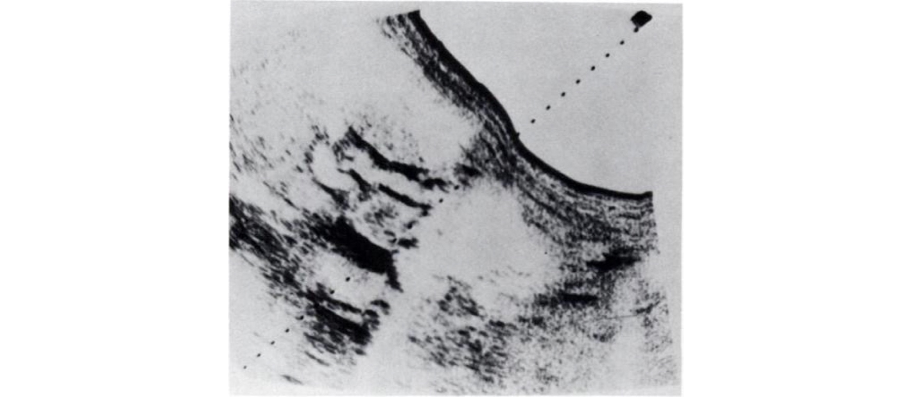

class: title
## Viewer Experience

---
class: title

### Kundel HL, Nodine CF. (1983) “A visual concept shapes image perception.” _Radiology, 146:_ 363–368. 

---
class: img-caption

--
<q>sonogram of the abdomen, revealing dilated common bile duct with large eye carcinoma at the head of the pancreas</q>

---
class: title 

background-image: url(kundel_nodine1.png)

---
class: img-caption

--
Bos taurus 
--
(otherwise known as "a cow")
---
class: title 

background-image: url(kundel_nodine2.png)

---
class: title 

## Viewing Context

---
class: title, smokescreen 
background-image: url(chuttersnap-fyaTq-fIlro-unsplash.jpg)

--
# 

---
class: title 
background-image: url(r_-r-2_BZuGgkP4k-unsplash.jpg)

# 

---

## Andy Warhol
### _Heinz Ketchup,_ 1964 

---
class: title
## Aesthetic Judgement ("taste")

---

Taste as _"cultivated"_ 

---

## Connoisseurship

---
class: img-left

### Norman Rockwell _The Connoisseur,_ 1961.

---
class: img-left

Pierre Bourdieu  
_Distinction:  A Social Critique of the Judgement of Taste_ (1979 / 1984).

Explores relationships between:
* economic class and taste  
* economic class and social capital

---

According to Bourdieu, judgements of taste express a class-based **habitus**, and are one of the defining elements of social identity.

> <q>Nothing more clearly affirms one's 'class', nothing more infallibly classifies, than tastes in music...there is no more 'classificatory' practice than concert-going, or playing a 'noble' instrument.</q> <cite>&mdash; Bourdieu (1979) Distinction, p. 18</cite>
---
class: img-caption

Thomas Kinkade, _The Forest Chapel_  (1999)

---
class: title, center
 
Kazimir Malevich, Black Square (1913)

---
class: title

## kitsch

---

## Some theories about the origin of "kitsch"

* word emerged in the art markets of Munich in the 1860s and 1870s, describing cheap, popular, and marketable pictures and sketches  
--

* From the dialect German word, _kitschen_ - to smear  
--

* From the German verb _verkitschen_ - to cheapen  
--

* A mispronunciation of the English word _sketch_, or an inversion of the French _chic_ (fashionable)

---

 
Knick-knacks on the shelf at a dollar store

---

 
**Hand Painted Porcelain, 1950s** $60 on Etsy

---
## Recoding Kitsch as Art

 _Michael Jackson and Bubbles_ 
Jeff Koons, Banality series, 1988

---
class: img-left
## Recoding Kitsch as Art

  

  Originally priced at $250,000 in 1988, it sold for a record $5.6 million in 2001 to Norwegian collector Hans Rasmus Astrup

---

class: title 
background-image: url(koons_silver_bunny.png)

---
class: img-right

# NFTs

Non-Fungible Tokens
---

class: title, smokescreen, shelf, no-footer
background-image: url(interpellation_cover.jpg)

# Viewers Make Meaning
### Part 2: Ideology &amp; Encoding/Decoding September 6, 2021

---
class: img-left-full
# Review:

Barthes' notion of **_myth_**&colon;

--
* Connotations that function _ideologically;_ that is, meanings that are specific certain groups are made to seem natural, univeral, and given for a whole society.    

--
* Ideology as the _naturalization of the contingent._

---
class: roomy 

# Ideology:

* As the _naturalization of the contingent._ (Barthes)  

--

* As _propaganda_.  

--

* As _false consciousness_. (Marx) 

---
class: title

## Louis Althusser (1970) “Ideology and Ideological State Apparatuses”

---

## Ideology (Althusser):

--
* is "the imaginary relationship of individuals to their real conditions of existence"   

--
* "has a material existence" (e.g. ideology exists in/as an _apparatus_:  an institution, a power structure, and its practices.)  

--
* "hails or interpellates concrete individuals as concrete subjects." 

---

   
> "I shall then suggest that ideology 'acts' or 'functions' in such a way that it 'recruits' subjects among the individuals (it recruits them all), or 'transforms' the individuals into subjects (it transforms them all) by that very precise operation which I have called interpellation or hailing, and which can be imagined along the lines of the most commonplace everyday police (or other) hailing: 'Hey, you there!"

---
class: roomy
## Interpellation:

* "Hey you there"  
* Ideology interpellates the individual as a subject  
* Ideology  subjects,  its  function  is  to  subject,  to  unfold the  process  of  subjectivation.

---

background-image: url(i_want_you.png)

---
class: no-footer center
<iframe width="90%" height="90%" src="https://www.youtube-nocookie.com/embed/BUvEEVq4woU" frameborder="0" allow="accelerometer; autoplay; encrypted-media; gyroscope; picture-in-picture" allowfullscreen></iframe>

---
class: col-2 compact

* We are constantly interpellated through the media we encounter in daily life
* This may be more or less direct (advertising often addresses the viewer directly with the imperative or a question: “embrace your cozy time” “got milk?” )

---
class: col-2 compact

* We are constantly interpellated through the media we encounter in daily life
* This may be more or less direct (advertising often addresses the viewer directly with the imperative or a question: “embrace your cozy time” “got milk?” )
* Interpellations “address” us with implicit ideas that we are encouraged to accept: ideological notions of  gender, sexuality, race, class, standards of beauty, citizenship, etc.

---
# Interpellation is a *negotiated* practice

...Subjects may not feel addressed by a cultural text, may resist interpellation, or may reproduce codes and conventions unfaithfully or inaccurately

---
class: title

# Encoding / Decoding
## Stuart Hall

---
class: roomy

## Stuart Hall

For Stuart Hall, the process of communication involves the articulation of linked but distinctive moments:

* production  
* circulation  
* distribution/consumption  
* reproduction  

---
class: center

<small>Shannon & Weaver, 1948 “A Mathematical Theory of Communication” _Bell System Technical Journal_</small>

---
# Reproduction?

>“Once accomplished, the discourse must then be translated– transformed, again – into social practices if the circuit is to be both completed and effective. If no “meaning” is taken, there can be no “consumption”. If the meaning is not articulated in practice, it has no effect.” (Stuart Hall)

---
class: center

<small>Hall's Visualization of Encoding / Decoding of Broadcast Media</small>

---
# Different "Decoding Positions"

1. **Dominant / Hegemonic**: The "Preferred Reading" or interpretation.  
--

2. **Negotiated**: A Negotiated Reading - Accepting some of preferred reading, rejecting or ignoring other parts.  
--

3. **Oppositional / Counter-Hegemonic**: A “Globally Contrary” or Oppositional Reading.

---

## Hegemony

Stuart Hall adopts this term from Italian philosopher Antonio Gramsci

* Dominant ideologies offered and experienced as _"common sense"_

* Dominant ideologies are locked in struggle with other "counter-hegemonic" forces so their dominance is never guaranteed.

---
# For Wednesday

Read:

* Barthes, Roland. (1967⁄1977). “Death of the Author.” in _Image-Music-Text_. London: Fontana Press. pp. 142-148.

* Foucault, Michel. (1969⁄1998). “What is an Author?” in _Aesthetics, Method, and Epistemology (Essential Works of Foucault, 1954-1984, Vol. 2)_. New York: The New Press. pp. 205-222.

!!! **Important**&colon; These are difficult readings.  Read 2 - 3 times.  Don't wait until Tuesday evening!!
