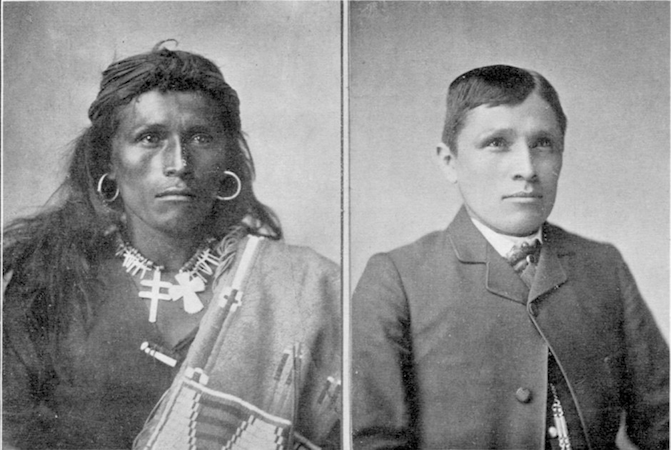
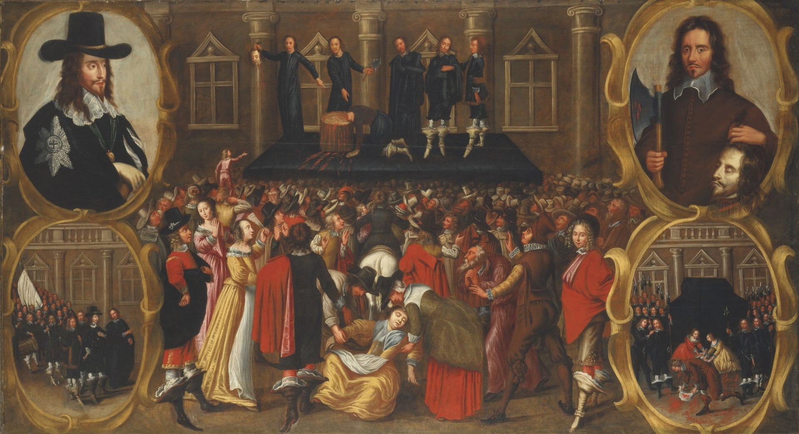

class: title

# Thoughts on Abreu or Parnham?

---

# Complex Dynamics of Hegemony (Abreu)

* Appropriation / Re-appropriation as Social Strategy   
--

* Different dynamics "from above" vs. "from below"

    * "From Below" &mdash; poaching, bricolage, culture jamming
    * "From Above" &mdash; extraction, expropriation, "eating the other" (bell hooks)
--

* Role of upwardly mobile but adjacent subject positions with affinity for counter-/non-hegemonic cultural practices

---

class: title, fogscreen, shelf, no-footer
background-image: url(luca-bravo-xnqVGsbXgV4-unsplash.jpg)

# Modernity
## Spectatorship, the Gaze, and Power, Part 1 September 15, 2021

---
class: col-2, no-title

# Modern | Modernity | Modernism

* **Modern** &mdash; A quality or condition of “being modern”, breaking from the traditional or from the past
* **Modernity** &mdash; An historical period (starting c. the 18th century with the Enlightenment) associated with particular social, economic epistemological and ideological shifts
* **Modernism** &mdash; An artistic, literary and scientific movement.  Not a synonym for modernity.

 <caption><small>Vladimir Tatlin, <em>Model for Monument to the Third International</em> (1919-20)</small></caption>

---
class: compact

# Modernity:  Key Themes

* Emergence of Enlightenment and new understandings of knowledge and the individual subject as an embodied ego (Descartes: “I think therefore I am”)

* Birth of liberal-humanist notions of individual rights

* Belief in progress and the scientific method

* Belief in “master narratives” of progress: religion, science, psychoanalysis, Nation/Empire, Enlightenment, etc.

**Historical conditions:** 

scientific advances, revival of classical Greek and Roman knowledge, Renaissance, Reformation and post-Reformation, colonialism and empire, democratization of knowledge and politics, invention of the printing press, mass literacy, industrialization, urbanization, birth of mass media, innumerable technological changes

---
# Individual Human Subjects

The individual is a concept that we do not take for granted in visual theory. Our goal is, in part, to ask how we come to experience the world as individual human subjects. Most important for us is the question of what role images and practices of looking play in the making of this entity, the human subject.
---

# The Individual Subject as Modern "Invention"

An individual as “a conscious, self-knowing, unified entity with rights and freedom to think and act autonomously” (Sturken &amp; Cartwright: 101)

--
> I think, therefore I am.
>
> <cite>Descartes</cite>

--

This model is taken up, challenged and reworked by other modern thinkers including Lacan, Freud, Marx and Foucault, questioning Descartes’ ideas about agency, self-knowledge, and unity.

---
class: img-left no-footer
# Spectatorship

 <small><caption>Diego Velazquez, _las Meninas_ (1656)
</caption></small>

See pp. 105-107 for a detailed reading of this painting and the way the work ambiguously positions its “external spectator”

---
class: img-right compact no-footer

# The Gaze &amp; Theories of Address
--

* **gaze** - a mode of looking undertaken by spectators as particular viewers (male, hetero, white, Western, etc), often theorized as shaped by the _unconscious_ or _desire_
--

* The **field of the gaze** _positions_  and _produces_ the viewer as the subject of a particular gaze.  It is a "structural" position.
--

* **address** - how an visual representation invites certain types of responses from particular categories of viewer, e.g. male, female, cis, hetero, LBGTQ*, white, BIPOC, etc.

???
“Spectatorship theory has drawn attention to this field and its discursive framework as well to the broader cultural contexts that inform it. When we consider the "field of the gaze" in, say, a visit to a museum or a theater, we may take into account who is present, who stands where, what hangs on the walls, how the show is organized, and who is drawn or permitted to walk and look where-all within the "discourse" of museum culture. That field reflects its broader historical and social contexts.” 

---

class: title no-footer
background-image: url(fashion_primitivism.png)

---
class: img-left

# Modernism in Art

<small>Natalia Goncharova, _Cyclist_, 1913</small>

1860s - 1970s

* Cubism
* Fauvism
* Futurism
* Vorticism
* Suprematism
* and more . . .

???
certain underlying principles that define modernist art: A rejection of history and conservative values (such as realistic depiction of subjects); innovation and experimentation with form (the shapes, colours and lines that make up the work) with a tendency to abstraction; and an emphasis on materials, techniques and processes. Modernism has also been driven by various social and political agendas. These were often utopian, and modernism was in general associated with ideal visions of human life and society and a belief in progress.

Marinetti expressed a passionate loathing of everything old, especially political and artistic tradition. "We want no part of it, the past", he wrote, "we the young and strong Futurists!" The Futurists admired speed, technology, youth and violence, the car, the airplane and the industrial city, all that represented the technological triumph of humanity over nature, and they were passionate nationalists. They repudiated the cult of the past and all imitation, praised originality, "however daring, however violent", bore proudly "the smear of madness", dismissed art critics as useless, rebelled against harmony and good taste, swept away all the themes and subjects of all previous art, and gloried in science.

In "Suprematism" (Part II of The Non-Objective World), Malevich writes:
“Art no longer cares to serve the state and religion, it no longer wishes to illustrate the history of manners, it wants to have nothing further to do with the object, as such, and believes that it can exist, in and for itself, without ‘things’ …”

---
class: img-right
# Peak Modernity

 <small><caption>Shopping Arcade</caption></small>

> "...the height of colonialism, the spread of industrialized science and technology, the movement of western populations from rural communities to cities to work in factories, and the emergence of mass markets, mass audiences, and national media cultures." (Sturken &amp; Cartwright: 91)

---
class: img-right roomy

# The Dark Side of Modernity

* social malaise of the alienated individual

* lost in the crowds of the modern city
--

* dehumanized by industrialized life

---
class: img-left, compact
# Modernity &amp; Colonialism

 <small><caption>Anonymous cartoon (U.S.) depicting the UK as “The Devilfish in Egyptian Waters” grabbing land on every continent (1882)
</caption></small>
--

* Modernity took different forms in the Global South, Western and Central Europe, Central and South America

* So-called “alternative modernities” took place with different dynamics and temporalities, and also included anti-colonial struggles and ongoing technology transfer (often via the Global North), alongside continued economic &amp; environmental exploitation as well as cultural and political domination.

* Long-term social and environmental impacts globally

---
class: center compact
# Modernity &amp; U.S. Settler Colonialism

 
<small>colonial strategies of modernization</small>

???
the Eurocentric belief that European practices and beliefs were objectively better (more advanced, more sanitary, more ethical, more modern) than the cultural prac­tices and ways of knowing and living in the world that had been in place in the territory colonized prior to colonization. 

Tom Torlino, a Navajo teenager. The image on the left is him as he looked when entering the school in 1882 – the image on the right is him three years later after they had worked him over.

---

# Discipline / Normalization / Subjectification

For Foucault, modern power is not something that negates and represses so much as it is a force that produces: it produces knowledge, and it produces partic­ular kinds of citizens and subjects 

---
class: img-caption

Michel Foucault&colon; Discipline & Power

---

background-image: url(native_school2.png)

???
cultural apparatus of discipline, a social technology geared toward disciplining both individual bodies as well as populations into what Foucault calls “subjected and practiced bodies, ‘docile’ bodies. Discipline increases the forces of the body (in economic terms of utility) and diminishes these same forces (in political terms of obedience) . . . [D]isciplinary coercion establishes in the body the constricting link between an increased aptitude and an increased domination” (Foucault, 1979: 138)

---

# Panopticon

???
Whereas monarchies and totalitarian political systems function through the overt exercise and display of punishment, such as public execution for the violation of laws, in modern societies power relations are structured to produce citizens who will actively participate in self-regulating behavior. 

---
class: col-2

# Disciplinary power replaces older forms...

* Bentham was a prison reformer, and in his context (England at the turn of the 18th century) confinement was replacing older forms of punishment like public execution
* Significantly, these changes are related to Enlightenment ideas about individual subjects as people with souls that could be reformed

 <small><caption>Anonymous Dutch painting of the execution of Charles I, 1649</caption></small>

---
class: title, fogscreen
background-image: url(surveillance_cams.png)

--
# Disciplinary Society as Generalized Condition

---

# For Friday

* Identify a set of visual artefacts as candidates for the class' "2021 Visual Culture Time Capsule" [preparatory work for [Blog Post #1](https://sakai.duke.edu/access/content/group/VMS-202D-001-F21/Assignments/blog1_visual_time_capsule.pdf)]
* Complete Quiz #3

# For Monday

* Read _Practices of Looking_, Chapter 3 (pp. 113 – 138)