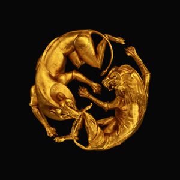

class: title, top, fullbleed, color-white, no-footer
background-image: url(nathan-anderson-99542-unsplash.jpg)

# Welcome to VMS 202D

---
class: title, smokescreen, shelf, no-footer
background-image: url(nathan-anderson-99542-unsplash.jpg)

# VMS 202D
### What is Visual Culture? August 29, 2022

---
class: title

## Welcome and Introductions

---
class: img-right

# Textbook

_Practices of Looking:   
An Introduction to Visual Culture_   
(3rd Edition, 2017)

Authors:   
Marita Sturken and Lisa Cartwright

---
class: img-right-full

# Course Mechanics

---

class: img-left-full

# Course Website

https://mjvo.github.io/vms202d

---
class: roomy 

# What does it mean to study visual culture?

> "Visual culture is concerned with visual events in which **information**, **meaning** or **pleasure** is sought by the **consumer** in an **interface with visual technology**.  By visual technology I mean any form of **apparatus** designed to be looked at or to enhance natural vision, from oil painting to television and the internet."

> &mdash; Nicholas Mirzoeff, *[An Introduction to Visual Culture](https://www.google.com/books/edition/An_Introduction_to_Visual_Culture/hhajBE0mUfwC?hl=en)*, p. 3

???

Difference between information and meaning?  Value?

---

## Culture

--

* Culture as Distinction (Hierarchies & Power) "the best that has been thought and said"| High culture vs pop culture vs low culture, etc

--

* Anthropological View of Culture "the shared practices of a group, com­munity, or society, through which meaning is made out of the visual, aural, and textual world of representations."

---
background-image: url(visual_culture.png)

---
class: title, fogscreen, top

# The study of visual culture centers the visual (visual objects, ways of looking, visuality) as a way of understanding history &amp; practices of meaning-making.

---
class: compact, fit-h1, center

# *Mood 4 Eva* (2021), Beyoncé, JAY-Z, Childish Gambino, Oumou Sangaré
<iframe width="90%" height="90%" src="https://www.youtube-nocookie.com/embed/MMuUFjxLQJU" frameborder="0" allow="accelerometer; autoplay; encrypted-media; gyroscope; picture-in-picture" allowfullscreen></iframe>

---
class: img-caption

# Disney+
---
class: col-2, compact

## Black is King (2020)

## The Lion King: The Gift (2019)

---
class: col-2, center

# *Coming to America* (1988)

---
class: col-2

# *Belly* (1998)

  

  

---
class: compact
# Esher Williams, *Bathing Beauty* (1944)

<iframe width="68%" height="51%" src="https://www.youtube-nocookie.com/embed/BNlyz1eBRB4" frameborder="0" allow="accelerometer; autoplay; encrypted-media; gyroscope; picture-in-picture" allowfullscreen></iframe>

???
And 2020 olympic synchro swim team from Jamaica

---
## For Wednesday

Post:
* Introduce yourself on our Sakai sites' [Conversation](https://sakai.duke.edu/x/Y0pfVU) within the "Introduce Yourself!" discussion, and share an artifact of visual culture of recent interest.

Read:
* *Practices of Looking*, Intro & Chapter 1 (pp. 1 - 29)   
[[PDF on Sakai](https://sakai.duke.edu/access/content/group/VMS-202D-001-F22/Readings/POL-intro_chapter1_1-29.pdf) if you've not yet purchased the book]