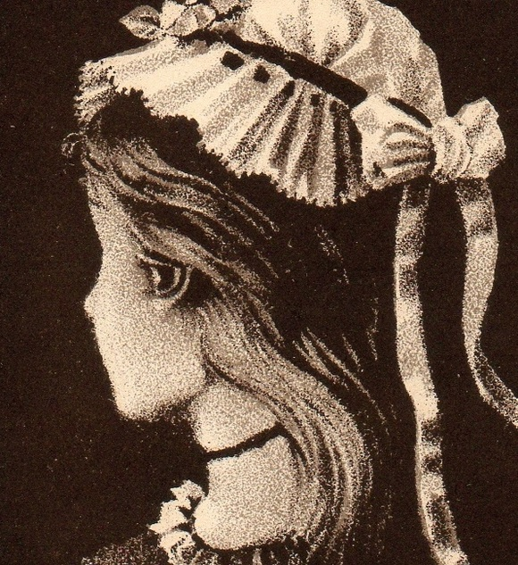

---

class: title, smokescreen, shelf, no-footer

# Images, Power, &amp; Politics
### Part 1 August 31, 2022

---
class: compact
# The Politics of Representation

<iframe width="80%" height="80%" src="https://www.youtube-nocookie.com/embed/MMuUFjxLQJU" frameborder="0" allow="accelerometer; autoplay; encrypted-media; gyroscope; picture-in-picture" allowfullscreen></iframe>

---
class: col-3, compact

# Intertextuality in *Mood 4 Eva*

* **Intertextuality**: The referencing of one text _(or image)_ within another.   
   
   In popular culture, intertextuality refers to the incorporation of one text within another in a ***reflexive*** fashion.   

* _Intertextual references assume that the viewer *knows* the people, events, and/or cultural products being referenced._

--

* the politics of knowledge (culture as distinction: insider/outsider)

---

> How do you look?

---
class: compact 

# How Do You Look? - Looking as Practice

* How do you appear?  (To others / to yourself)

--

* _Do_ you appear (in/visibility)?

--
* How do you see?

    * Point of view / identity &amp; background (race, class, gender, sexuality, religion, ...) 
    * Quality of the Look (gaze, glance, stare, voyeuristic)
    * "Through" some medium (screen, lens, etc)
--

* _Do_ you see? Are you unable to see?  What is hidden from your gaze?
--

* Do you have the "right to look"?  (Do you have to claim or assert it?)

--

* Are you compelled to look?  (Through force, authority, desire)

---

class: img-caption

---
# Visuality

> “Whereas the term vision refers to the physical capacity to see, the concept of visuality refers to the ways that **vision is shaped through social context and interaction** [...] Visuality is a term that calls our attention to how the visual is **caught up in power relations that involve the structure of the visual field** as well as the politics of the image”   
> &mdash; Sturken &amp; Cartwright, p. 22

---
class: col-2

# Practicing Looking: Classroom v. Zoom

Free Writing (5 minutes):   
   
   What are the differences between the in-person classroom experience and zoom?

* What do you see vs. what remains hidden?
* How do you see in each space?  How do you appear to yourself and others?
* Is your "right to look" different in each space?  How?
* Where / how might one assert agency over the visual field in each space? 

---
class: col-2, compact

### Visual culture is concerned with *histories of representation*

* Re-present: literally, to "show again"

* "The use of language, marks and images to depict, symbolize, or portray and make meaning from reality (the world around us)" (Sturken & Cartwright, pp. 18-19)

* Some representations we think of as mimetic (aim to be a "mirror copy" of the real/material world). 

* But all representation is **mediated** in some way, refracting that mirror image.

---
class: img-left

### Mimesis

Chuck Close   
*Big Self Portrait* (1967-68)

---
class: col-2

## Construction

* Mirrors don't reflect back faithfully; they distort  
* The irreducible "gap" between the representation and the thing represented (the "thing itself") *matters*  

*The Treachery of Images* Rene Magritte (1928-29)
---
class: center
## Indeterminacy

---
class: img-right

# What color is this dress?

* Blue?
* Gold?
* White?

---
class: img-left

## Polysemy

---
class: col-2 compact
# Polysemy and Power

--

---

## "Seeing That" vs "Seeing As"
Wittgenstein 

---
class: center

### Kanizsa Triangle

---
class: compact 

**For Friday:**
* Review lecture notes and Chapter 1, pp 1 - 29.
* Watch:
    * [Stefano Harney on Study](https://www.youtube.com/watch?v=uJzMi68Cfw0)
    * [Fred Moten on Figuring It Out](https://www.youtube.com/watch?v=SmnFeGaCkGI)
    * [Ulay Interview: How I Stole a Painting](https://www.youtube.com/watch?v=i2E0J6J3KGI)
    * [Photographing Secret Sites and Satellites | Meet Trevor Paglen](https://youtu.be/9Igfu0VwdkQ)   
       

 
**For Monday:**

CLASS WILL BE HELD IN 103 CLASSROOM BLDG on East Campus

Read:
*  _Practices of Looking_, Chapter 1 (pp. 29 - 49) 