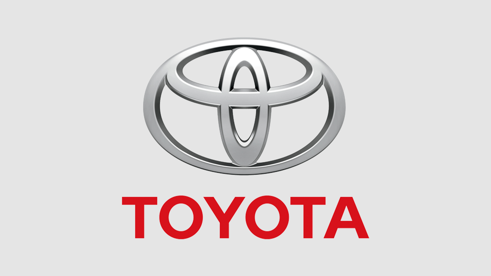
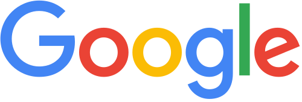
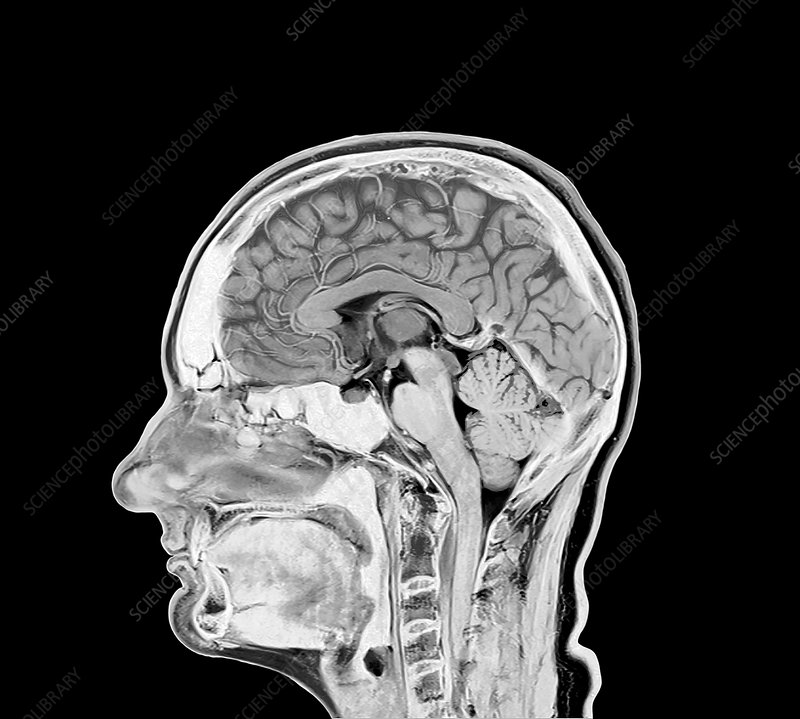
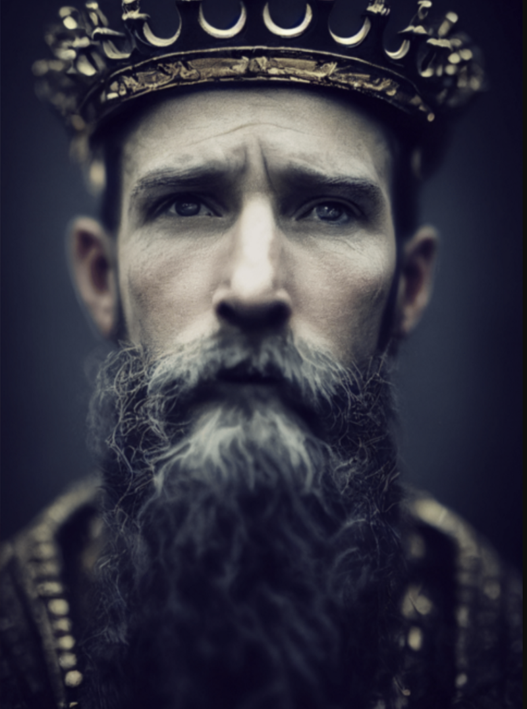
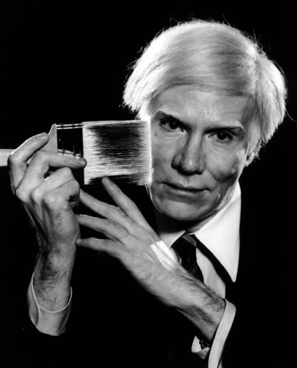
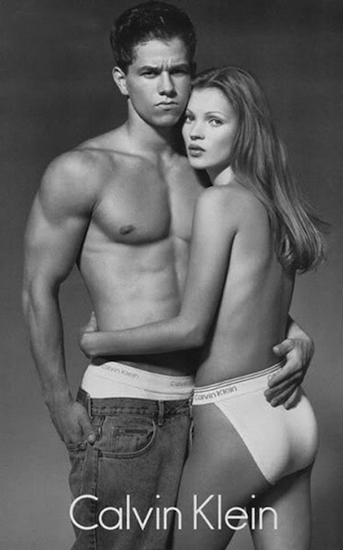
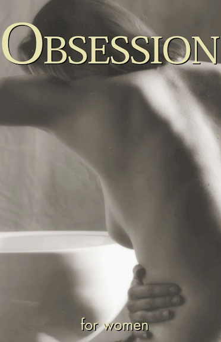

class: center


https://duke.is/yxmc7


---

class: col-3

# Semiotics: Degrees of Motivation, cont'd

<br /><br />

<br /><br />



???
Toyota logo . . . 
Ovals represent hearts . . . The three ellipses within the logo purportedly represent three hearts. One ellipse is the heart of the customer, another represents the heart of the product. The last ellipses are the heart of progress in the field of technology.

Google logo -- symbolic   . . . primary colors . . .use of the 2ndary color on "l" connotes that "Google doesn't follow the rules"

Addidas logo:  Mountain icon

---
class: col-2

# Semiottics: Degrees of Motivation, cont'd 





---

class: title
background-image: url(saussure_peirce.png)

---
class: title
background-image: url(saussure_vs_peirce.png)

---
class: img-left compact
# Barthes' Contribution to Semiotics


* **Denotation**<br>
--
    The _literal_ meaning of a sign

--
* **Connotation**<br>
--
    Social, cultural, &amp; historical meanings that are "added" to denotation

--
* **Myth**<br>
--
    The hidden set of rules, codes, &amp; conventions through which meanings, which in reality are specific to certain groups, are _rendered universal and given for a whole society._  They are **naturalized**.

---
class: col-3
# Semiotics Key Terms

* Dyadic Structure of a Sign (Saussure)<br><br>
    <br><br><br>
* Continuum of “Motivation” (Peirce)<br><br>
    * Symbol<br><br>
    * Icon<br><br>
    * Index<br><br><br><br><br>
* Levels of Signification (Barthes)<br><br>
    * Denotation<br><br>
    * Connotation<br><br>
    * Myth

---

class: title, smokescreen, shelf, no-footer
background-image: url(warhol_heinz.png)

# Viewers Make Meaning
### Part 1: Codes, Viewers, Contexts<br>September 7, 2022

---

<br><br><br><br>
> Where does the meaning and/or value of an image lie?

---
class: img-right
# Intrinsic


Is it _intrinsic_ or _inherent_ to the image itself?


---
class: img-left
# Intention



Does it rely on the creator's intention?

---
class: img-right
# Production of Meaning


* Intrinsic to the Image<br><br>
* Producer's Intention<br><br>
--

* **Codes and Conventions**<br><br>
--

* **Viewers and their Experiences**<br><br>
--

* **Viewing Context**

---
class: img-caption


What are the codes that structure a Calvin Klein ad?

---
class: center


---
class: img-left
<br> 

--


---
class: center


---
class: center


---
class: center



---
# Syntagm and Paradigm

---
# Syntagm

* Syntagms define a sequential "grammar" to signs:<br><br>`subject-verb-object` or `this and this and this`<br><br>
* Syntagmatic relationships are about **positioning**, the _syntax_ of a sentence or an image.

_"John ate an octopus."_   ≠  _"An octopus ate John."_

---
class: col-2
# Syntagm

Poets and artists and ad execs play with the syntagmatic grammar of visual and textual signs

```html
so much depends
upon

a red wheel
barrow

glazed with rain
water

beside the white
chickens

- William Carlos Williams
```

---
class: img-caption

# Meme Culture


---


---
# Paradigm

* Paradigms refer to **sets** of signs that can be substituted for each other and still convey meaning.<br><br>
--

* Convention or logic indicates a _set_ of signs that "can" or "should" be substituted for each other:<br><br>
    _"John cooked **fish**."_ |  _"John cooked **corn**."_ | _"John **grilled** corn."_<br><br>

--

* Some paradigmatic substitutions render a collection of signs _poetic_ &mdash; 
--

`"The sun cooked the pavement."`
--

&mdash; or sometimes _meaningless_&colon;<br> 
--
`"John cooked semiotics furiously."`

---

Discuss&colon;<br>How do the paradigmatic and syntagmatic axes relate to an advertising campaign?  To culture jamming?

---
class: title
background-image: url(enjoy-capitalism.jpg)

---
class: center


---
class: col-2, fit-h1, roomy

# Key Issues in “Art, Power, and Profit at Duke University"

* Appropriation

* Authorship

* Institutional Authentication

* Originality and the politics of reproduction   
<br /><br /><br />
* Copyright    

* Art Markets

* Race &amp; Representation

* Others?

---
# For Friday:

* Review your notes on PoL chapter 1 and from lecture, esp. semiotics key concepts
* Reread Casey, Brenna M. (2021, August 29).  "[Art, Power, and Profit at Duke University](https://www.theassemblync.com/long-form/art-power-and-profit-at-duke-university)"  The Assembly.  [PDF version](https://sakai.duke.edu/access/content/group/VMS-202D-001-F22/Readings/Art%2C%20Power%2C%20and%20Profit%20at%20Duke%20University.pdf)

<hr />
# For Monday:

Read:

* Practices of Looking, Chapter 2 (pp. 74 – 88)<br /><br />
* Stuart Hall, “Encoding / Decoding” (1980⁄2006) in Durham, M.G. & Kellner, D.M. _Media and Cultural Studies: KeyWorks._ Malden, MA: Blackwell Publishing. pp. 163-173.
