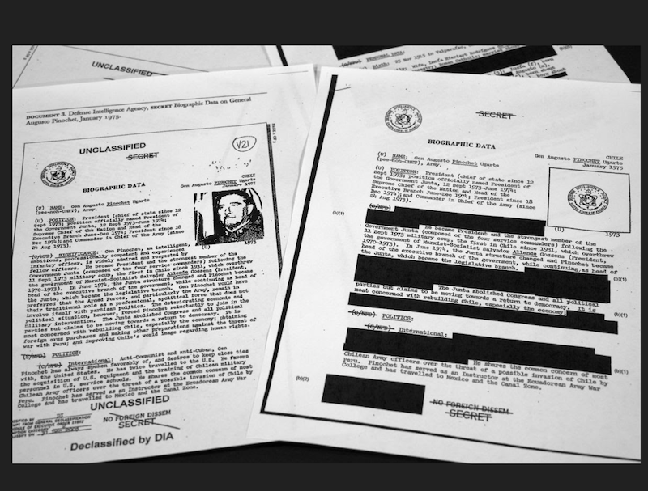

class: title, smokescreen, shelf, no-footer

# Visualization, Countervisuality,  &amp; Colonialism
###   September 26, 2022

---

class: 2-col, img-right-full, fit-h1

# Today's Theorist:  [Nicholas (Nick) Mirzoeff](http://nicholasmirzoeff.com/)

* Visual culture theorist and a Professor in the department of Media, Culture and Communication, New York University.

* Interested in technologies and techniques of visuality, decolonial thought, and the politics of vision.

* Author of _How to See the World_ and _An Introduction to Visual Culture_, two great primers on the field of visual culture/visual studies.

---

# Visualization

> "This practice must be __imaginary__, rather than perceptual [ ... ] the ability to assemble a visualization manifests from the __authority of the visualizer__ [ ... ] Visuality supplemented the violence of authority and its __separations__ [ ... ] this process is not composed simply of visual perceptions in the physical sense, but is formed by _a set of relations combining information, imagination, and insight into a rendition of physical and psychic space_."

> &mdash; Mirzoeff, pp. 2-3

---
class: compact, col-2

# Visualization / Visuality

A claim on the authority to look/see and determine the visible and, consequently, what is real.
* imaginary
* not necessarily perceptual
* mental / internalized, as well as material
* A complex of "techniques" that work together
    * Maps, diagrams, architectures, spatial divisions, technologies, media, images.
    * New techniques over time
* Writing a version of history or "the real"

 <caption><small>Redaction is a technique of visuality where an authority decides what can be seen in public documents.</small></caption>

---
 
 For Mirzoeff, modern visuality has its roots in (is constituted in and by) _colonialism_.
 
 These practices shift historically but survive into present in different forms and keep their political valence.

 Authority is maintained through:

 * Classification
 * Separation
 * Normalization / Naturalization

---
class: roomy, fit-h1

# Three Major Historical "Complexes" of Visuality

* Plantation Complex

* Imperial Complex

* Military-Industrial Complex

---
class: center

 <caption><small>"Indigo Terie," by Jean-Baptiste du Tertre (1667). Note the clear labeling and division of space, with the overseer in the center with a surveillant view (oversight) of the plantation.</small></caption>

---

class: center

 <caption><small>Visualizing the Battlefield:  Historical map of the Battle of Waterloo, June 18, 1815</small></caption>

---

class: center

 <caption><small>Battle Plan Visualization continues: RAF Fighter Command Operations, WWII ( 1941-45) at the RAF Uxbridge Operations Room, UK. Visualizing by bringing all of the information to the commander, symbolically representing the battle space in real time </small></caption>

---
class: center

 <caption><small>Imperial Visualization: Bird's Eye View of Manhattan & New York City in 1873. (The Brooklyn Bridge is obviously imaginary as the bridge would not be completed for another 10 years.) The image is an artificial rendering, essentially a map, and also shows all of the things the territory is DOING: shipping, industry, commerce, etc.</small></caption>

---

class: center

# Military-Industrial Visuality

 <caption><small>Image: Declassified aerial photographs from the Second Iraq war showing what US intelligence interpreted as evidence of the development of chemical weapons.</small></caption>

Aerial photography &mdash; the world seen from above &mdash; is both a political viewpoint and a set of strategic interpretations.

---
class: compact
# Post-Panoptic Visuality

The Mobile Drone Command Post. A combination of visual technologies an other information, often information computed algorithmically based on massive data-surveillance; decision-making power is partially removed to machines; the seeing/being seen dyad is completely asymmetrical with remote viewing/sensing and targets often not being allowed to know about the information used to target them.

---
class: roomy

> **Countervisuality**, then, is not just a different way of seeing or a different way of looking at
images but _the tactics to dismantle the visual strategies of the hegemonic system._ It is, in other words, "the attempt to reconfigure visuality as a whole" (p. 24) and thus "the right to look," which goes even further than just the right to look back, although looking back is the first step towards countervisuality.

> Jan Baetens [reviewing Mirzoeff, in _Leonardo_, 2013](https://muse.jhu.edu/article/493132)

---
class: fit-h1, compact

# Countervisuality &rarr; a Claim for the "Right to Look"

> It begins at a personal level with the look into someone else’s eyes to express friendship, solidarity, or love. That look must be mutual, each person inventing the other, or it fails. (Mirzoeff, 1)

* Autonomy from authority, "from below"
* Egalitarian, symmetrical
* A "right to the real," to determine for oneself what _is_, alongside others, in common with others
* Not just in the future, but in the present alongside practices of countervisuality throughout history: anticolonial, abolitionist, and antifascist politics &amp; movements (23)
* Not merely "opposed" to practices of visualization but instead "the attempt to reconfigure visuality as a whole," a "claim for the right to look," and "a dispute over what is visible." (24)

---

# Discussion: tactics of countervisuality today? 

Mirzoeff discusses several historic forms of countervisuality, from representations of abolitionist heroes, to the 19th century realist paintings of peasant and working-class life, to photographic documentation of the conditions of poverty.

In his words, "countervisuality proper is a claim for the right to look," which is also always a claim over the right to determine and make visible what is real, as well as a claim about history and what versions of history are valid. The right to look is a resistance to an authority that says _"this is what happened,"_ _"this is all there is,"_ or _"there is nothing to see here."_ 

What forms of countervisuality or claims for the right to look do you see at work in the world today, or in the recent past?

---

# For Wednesday

Read: 

* _Practices of Looking_, Chapter 3 (pp. 113 – 138)
