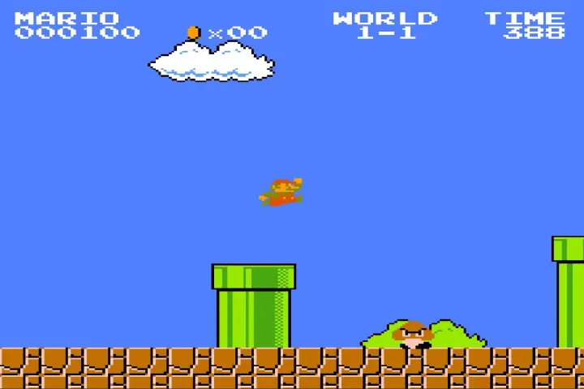

class: title, smokescreen, shelf, no-footer
background-image: url(redcharlie-sSpFDw4Id8g-unsplash.jpg)

# Realism and Perspective II
### From Renaissance Painting to Digital Media October 5, 2022

---
class: col-2, compact

# Renaissance Realism: Linear Perspective

 <caption><small>Sandro Botticelli, _Cestello Annunciation_ (1489)
</small></caption>
<small>
--

* Codified by Renaissance thinkers like Filippo Brunelleschi &amp; Leon Battista Alberti (early 1400s)
--

* Brunelleschi: image as a mirror or frame through which to view the world
--

* Use of instruments, mathematical calculation &amp; measurement for precise depiction of space &amp; form
--

* Thought of these rules as rational &amp; derived from nature itself
--

* Centering of the human observer/spectator, at the same time a sort of “replacement” of the seeing eye with mathematical techniques and instrumentation (152)
--

* “The Renaissance era embraced the idea that it is art’s social function to reproduce human vision through drawing instruments designed to replicate vision” (155)
</small>

---
# Brunelleschi's Experiment

<iframe width="85%" height="80%" src="https://www.youtube-nocookie.com/embed/bkNMM8uiMww" frameborder="0" allow="accelerometer; autoplay; encrypted-media; gyroscope; picture-in-picture" allowfullscreen></iframe>

---
class: compact
 <caption><small>Albrecht Dürer, _Draughtsman Making a Perspective Drawing of a Reclining Woman_ (~1600)</caption></small>

--

* Method — mathematization of space
--

* Metaphor — produces a singular subject position (Cartesian subject) &rarr; one point in space, not fragmented nor fragmentary 

???
cartesian coordinates

note the gendering of this gaze, the reclined female

---
class: fit-h1
# Photogrammetry: A Contemporary Example of the Mathematization of Space

<iframe width="85%" height="80%" src="https://www.youtube-nocookie.com/embed/POQj3BlH7gc" frameborder="0" allow="accelerometer; autoplay; encrypted-media; gyroscope; picture-in-picture" allowfullscreen></iframe>

---

class: col-2, compact

# episteme

Michel Foucault's concept

* “the way an inquiry into truth and the real is organized in a given era.  An episteme is an accepted, dominant mode of acquiring and organizing knowledge in a given historical period” (S&amp;K, 147)
* From the word “epistemology,” the branch of philosophy concerned with knowledge
* The use and development of perspectival techniques in the Renaissance reflect the embrace of science and rationalism central to that era’s episteme.

> “The question for us is **not** which approach to realism has resulted in the most accurate representations of the world at any given time, but what do the different approaches to realism that we find in art and visual culture tell us about the culture and politics of a given social context.”

><cite>&mdash; Sturken &amp; Cartwright</cite>

???
episteme - a way of ordering things, or the relation between words and things, the seeable and the sayable.  different ways of organizing and representing knowledge about things.

---
class: col-2

# Bonus: bizarre historical play with perspective

While most of the canvas is meticulously rendered in linear perspective, there’s a skull--a memento mori--painted in anamorphic perspective that projects in from the bottom.  It can only be seen correctly from one particular angle.

It’s also full of [layered symbolic meaning](https://www.youtube.com/watch?v=JFGSb1XVWes).

 <caption><small>Hans Holbein the Younger, _The Ambassadors_ (1533)</caption></small>

---
class: compact, fit-h1

# Challenges to Perspectival realism as a representational convention

* Emergence of alternative representational paradigms that reflected changing ideas about knowledge and human subjects, priorities in modes of representation, worldviews, for example:

  * **Impressionism** (end of the 1800s): defying perspective through emphasis on the artist’s “impression” of a scene, particularly the rendering of light and shadow through visible brushstrokes
  * **Cubism** (1910s-30s): rendering many views, perspectives simultaneously
  * **Abstract Expressionism** (1950s-60s): reflecting / expressing the artist’s embodied activity in making the work, gesture, spontaneity  

* Overall:  in the late modern period (late 1800s-1960s) there is a “questioning the representational traditions organized around the model of the Cartesian subject as the fixed center of the pictorial world”

---
class: img-caption

## Impressionism

Claude Monet, _Vétheuil in the Fog_, 1879

???

Monet demonstrated the complexity of human vision and depicted it as a fluid process that interacts with nature.

---
class: img-right-full

# Cubism

Marcel Duchamp _Nude Descending a Staircase (no. 2)_ (1912)

---
class: img-left-full

# Abstract Expressionism

Willem de Kooning, _Woman I_ (1950-52)

---
class: roomy
# Perspective and Realism Today?

--
* Reality TV  
* _[Insert Social Media Platform Here]_ Live  
* Video Games

???

Today, perspective is recognized as one possible realist technique among others; it does not characterize our era’s episteme in a totalizing way. The value of perspectival realism continues to derive from its status in some imaging modalities, such as lens-based systems, but not all. With the development and use of the camera obscura from the tenth to the nineteenth centuries, followed by its adaptation to the design of the photographic camera, single-point perspective has continued to hold its own as the standard for documenting space in an objective manner. Yet, at the same time, the photographic camera brings us back to empiricism, which is a counterpoint to the rationalism of mechanical objectivity through which we have interpreted perspective’s history

---
class: center
# Realism in Video Games

<iframe width="85%" height="80%" src="https://www.youtube-nocookie.com/embed/R2Ebc_OFeug" frameborder="0" allow="accelerometer; autoplay; encrypted-media; gyroscope; picture-in-picture" allowfullscreen></iframe>

???

Draw from cinematic realism  and the perspectivism of the cinematic camera
Immersion through play

---
class: col-2
# 2D Side Scrollers & Isomorphic Perspective

---
# Playing with Perspective:  _Antichamber_

<iframe width="85%" height="80%" src="https://www.youtube-nocookie.com/embed/mEbmtwzm2Qc?start=6" frameborder="0" allow="accelerometer; autoplay; encrypted-media; gyroscope; picture-in-picture" allowfullscreen></iframe>

---
# Playing with Perspective:  _Perspective_

<iframe width="85%" height="80%" src="https://www.youtube-nocookie.com/embed/SS4r9Fq3beU" frameborder="0" allow="accelerometer; autoplay; encrypted-media; gyroscope; picture-in-picture" allowfullscreen></iframe>

---
class: compact

# Main Points

### ...on perspective and realism from 500-odd years of art history

1. Realism and its representational codes are historically contextual, have engaged different meanings, styles, and techniques in different periods/places.

--

1. The history of realism is NOT a progressive history of the refinement of techniques/technologies for accurately representing reality.

--

1. The history of realistic representation is a history of representational codes, reflecting different, shifting, and sometimes competing worldviews, norms  and dominant ideologies about the nature of reality and how to best represent it.

--

1. <q>Realistic</q>mages are always more than simple windows onto the world; they are structured by codes and conventions, have agency.

---
# For Friday

* No Discussion Sections!

* HOWEVER:  **Complete Quiz #4 before 11:59 PM!**   

  

### Enjoy Fall Break

* October 12th will be midterm review.

* October 14th will be the miderm exam
