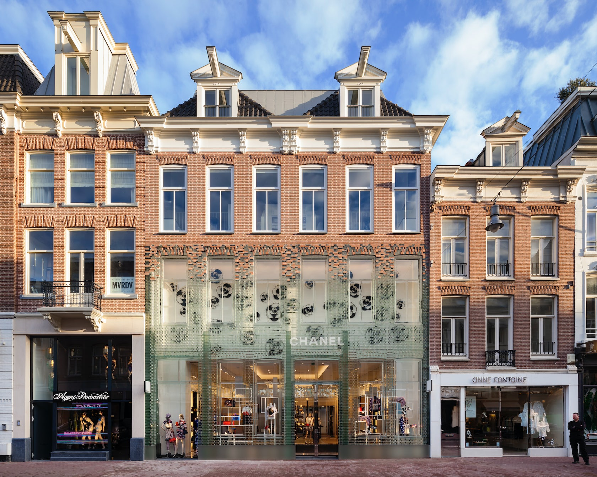
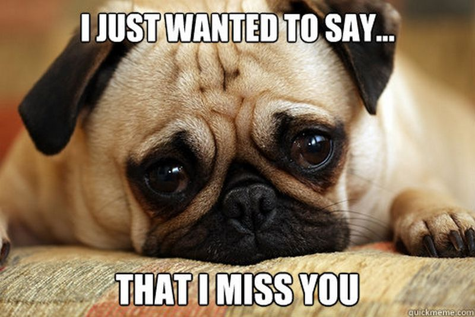
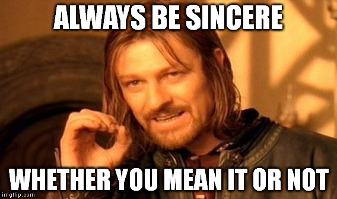

???
Relates to Situationist praxis

> Meshroom is a performance environment that forms an intellectual/intentional community around an open dancefloor. It is a space for transcending narrow languages, ungrounding from fixed realities, and co-creating temporary worlds in movement. Meshroom is shaped by the movement, dreams, hopes, and queerness of everyone in the room: it is a weaving of wild minds and soft bodies. All visitors are welcome to move, rest, witness, think, melt, and dance with live music and occasional performances. 

---
class: title, smokescreen, shelf, no-footer
background-image: url(postmodern_arch.jpg)

# Postmodern/ity/ism: 
## Irony, Parody, and Pastiche November 14, 2022

???
We live in a world that is rural, industrial, and postindustrial, in which many of the qualities that characterized modernity (for example, the acceleration of time and compression of space that resulted from urbanization, industrialization, and automation) have become conditions in postmodernity alongside and in relation to virtual technologies and the flows of capital, information, and media in the era of globalization.

---
class: fullbleed, no-footer, center, bg-black

---
class: roomy
# Postmodern

* After, or in reaction to, or a rejection of the modern

--

* *However,* the "post" is **always already** a modern logic: of breaking from the past/from tradition.

--

* Recognition of the above can invoke an affect of despair: There is no "outside" of modernity? of late capitalism?
--
 or perhaps nihilism &rarr; ("f*ck it, let's party")

--

* A certain kind (ironic?) of nostalgic relation to the past:  nostalgia for nostalgia

---
class: compact
# Postmodern Nostalgia

Fredric Jameson, "Postmodernism, or the Cultural Logic of Late Capitalism" (1984)

--

* the collective social desire to appropriate an idealized past through aesthetic representation (or, to use Baudrillard’s term, simulation). 

--

* Emptying signs of the past of their historical referents, and reinscribing these signs with connotations of a vague “pastness” that construct Barthesian “mythologies” of the past.

--

* Privileging the past as "lost object of desire” while effectively effacing “real history" ("genuine historicity")

--

#### >>> [Make America Great Again?](https://youtu.be/uVQvWwHM5kM)

---
class: compact

# Postmodernity

An historical period associated with particular social, economic, epistemological, and ideological shifts: after World War II, especially the changes occurring after 1968.  

--- 

---
class: center, fit-h1
# From Fordism to Post-Fordism &equals; Modernity to Postmodernity?

post-Fordist flexible accummulation (base) &darr; &darr; postmodernity (superstructure, or "cultural logic")

 Marxist economic determinism

---
class: compact
# Modernity vs Postmodernity
<small>

| Modernity (or The Age of Enlightenment Empiricism and Humanism)| Postmodernity (or The Post Truth Era?)
&nbsp;
 |
| :----------- | :----------- |
| belief in the possibility of a unified human subject | subjectivity is fragmented, contradictory; unity and coherence are effects of performativity |
| belief in fundamental, intrinsic, and universal (or classic) transcendent values, rights, and essential, autonomous, and self-sufficient objects, texts, and actions. | Relativism: views these constructs as contingent, insufficient, and lacking transcendence. |
| Belief in “master” or “meta narratives,” i.e., religion, science, psychoanalysis, Enlightenment myths of progress, economic determinism | questions master narratives in favor of difference, plurality, and multiplicity. |
| The application of Reason leads to a progressive movement toward civilization, democracy, freedom,scientific advancement. The Enlightenment is _prescriptive_: a means of building a better society. | There is no objective means upon which to predicate morality and right/just governance. Postmodern theory is _descriptive_ of the human condition; it describes an _impasse_ in philosophy and social/political relations. |
| reality, immediacy, the original  | hyperreality, hypermediacy, the simulacra |
| a continuous self-conscious, self-referential attitude, promoting social change and able to _absorb_ cultural postmodernism as one of the “isms” of the modern. | a philosophical approach toward the _deconstruction_ of modernism and its epistemologies. |

</small>

???
IMPORTANT!  Modernity and postmodernity co-exist

Raymond Williams theorized the co-presence of dominant, emergent, and residual cultural formations

> there is no precise moment of rupture between the modern and the postmodern. Rather, postmodernity intersects with and permeates late modernity, creating a context in which Enlightenment notions of liberalism, mod- ernization, and progress continue to compel development models in the Global South. The scientific and medical fields continue to invoke modernist approaches based on scientific truth and technological advancement, in defiance of the post- modern turn.

---
class: compact 
# Postmodernism

An artistic/architectural and literary movement.

* **Art/Architecture:** Rejected and replaced modernism in art. Characterized by anti-authoritarianism, or refusal to recognize the authority of any single style or definition of what art should be; and collapse of the distinction between high culture and mass or popular culture, and between art and everyday life. Postmodern art/architecture can be also characterized by a deliberate use of earlier styles and conventions, and an eclectic mixing of different artistic and popular styles and mediums. (Warhol, Lichtenstein, Cindy Sherman, Carolee Schneemann, Michael Graves)

* **Literature:** a form of literature which is marked, both stylistically and ideologically, by a reliance on such literary conventions as fragmentation, paradox, unreliable narrators, often unrealistic and downright impossible plots, games, parody, paranoia, dark humor and authorial self-reference.  (Thomas Pynchon, Don DeLillo, Kurt Vonnegut, David Foster Wallace)

---
class: center, no-footer
## Deadpool as Postmodern Cinema

<iframe width="85%" height="85%" src="https://www.youtube-nocookie.com/embed/ZgQlwscDyus?start=112&end=229" frameborder="0" allow="accelerometer; autoplay; encrypted-media; gyroscope; picture-in-picture" allowfullscreen></iframe>

???
Rejects grand narratives:  courtly love; good v evil; 
"Meta" and self-referential
breaking the 4th wall
Nothing is new

---
class: center, no-footer
## Postmodern Irony / Distance / Reflexivity 

<iframe width="85%" height="85%" src="https://www.youtube-nocookie.com/embed/ZgQlwscDyus?start=316&end=618" frameborder="0" allow="accelerometer; autoplay; encrypted-media; gyroscope; picture-in-picture" allowfullscreen></iframe>

???
Doesn't create anything new
Strategy of alt-right

---
class: col-2, roomy
# Postmodernity

* irony

* parody

* remix / pastiche

* simulation / hyperreal     

* style / surface

* reflexivity / distantiation

* no “outside” critique

* nothing is new

???
To review . . .

---
class: roomy
# Pastiche

* “an imitation that announces itself as such” (PoL 325)

* Etymology: French _pastiche_ &rarr; from Italian _pasticcio_ (“pie, something blended”) &rarr; from Vulgar Latin *pasticium* &rarr; from Latin _pasta_ (“dough, pastry cake, paste”) &rarr; from Ancient Greek _παστά_ (pastá, “barley porridge”) &rarr; from _παστός_ (pastós, “sprinkled with salt”). 

* If <u>**parody** imitates to _critique_</u>, then <u>**pastiche** imitates to _pay homage_</u>, or simply just to mimic.

???

Discuss:  Mode of intertextuality

---
class: col-2
# Pastiche in Architecture

 <small><caption>[Church of Sant Francesc Convent](https://architizer.com/projects/church-of-sant-francesc-convent/) by David Closes Arquitecte, Santpedor, Spain</caption></small>

 <small><caption>[Crystal Houses](https://architizer.com/projects/crystal-houses/) by MVRDV, Amsterdam, Netherlands</caption></small>

--

???
> Postmodern architecture stresses contextualization (buildings that speak to the architectural environments in which they are situated) and the capacity to speak on several levels at once, simultaneously referencing high architecture and mass culture. Many postmodern architectural designs plagiarize, quote, and borrow from previous and current styles

> Many elements of postmodern buildings challenge architectural functionality. An arch may have no structural function, a passage may lead nowhere, a façade may conceal nothing

---

class: center, compact, no-footer, full-bleed
## Pastiche in Film

<iframe width="80%" height="80%" src="https://www.youtube-nocookie.com/embed/JpHE7vXE3-A?start=25&end=135" frameborder="0" allow="accelerometer; autoplay; encrypted-media; gyroscope; picture-in-picture" allowfullscreen></iframe>

---
class: center, no-footer
## Parody or Pastiche?

<iframe width="85%" height="85%" src="https://www.youtube-nocookie.com/embed/_ZBKX-6Gz6A?end=53" frameborder="0" allow="accelerometer; autoplay; encrypted-media; gyroscope; picture-in-picture" allowfullscreen></iframe>

---
class: center, no-footer
# Post-Postmodern / The New Sincerity?

---
class: center, no-footer
# Nerds vs Hipster Smack-Down!

<iframe width="80%" height="80%" src="https://www.youtube-nocookie.com/embed/f3xe-Wxio1o?end=177" frameborder="0" allow="accelerometer; autoplay; encrypted-media; gyroscope; picture-in-picture" allowfullscreen></iframe>

---
# New Sincerity?  Irony?  

---

# For Wednesday

Read: 

* _Practices of Looking_, Chapter 7 (pp. 257-299)