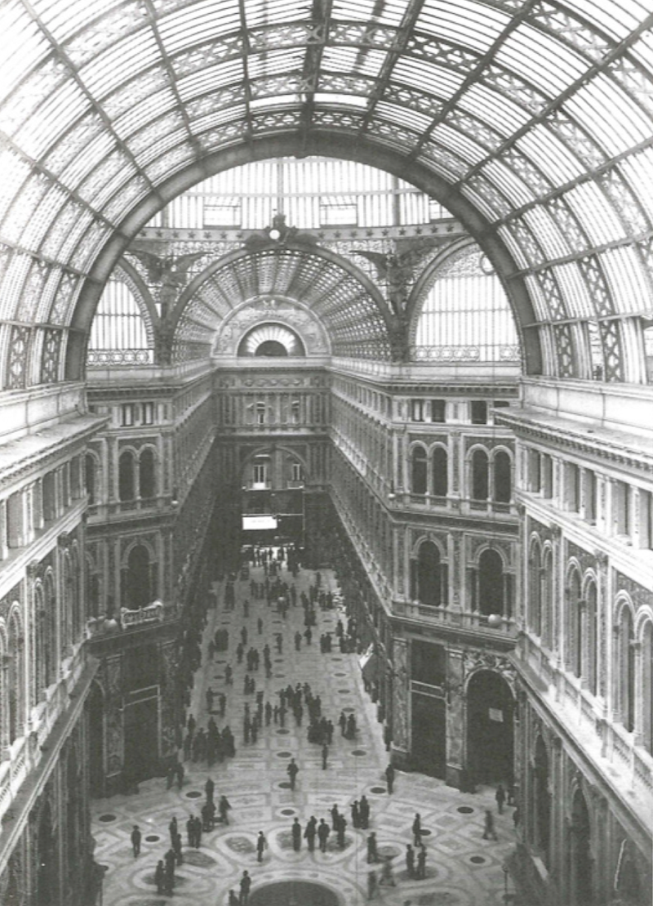
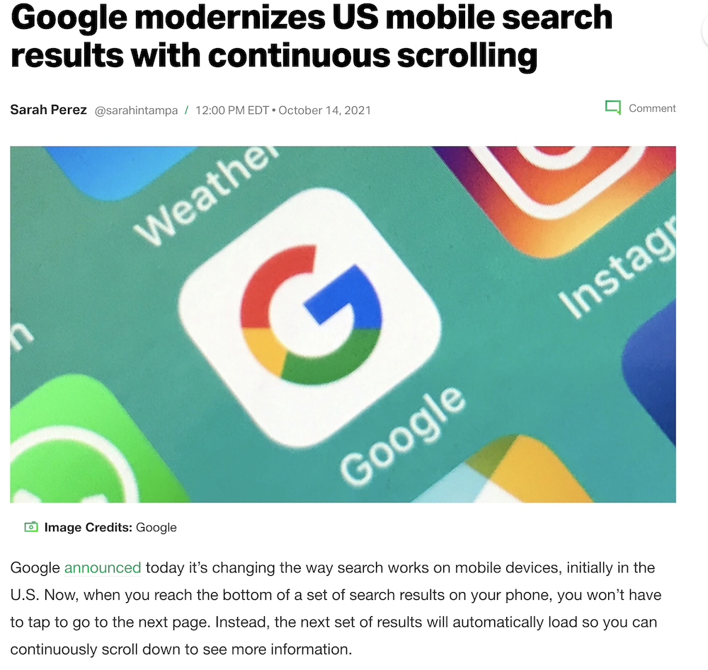

class: title, smokescreen, shelf, no-footer
background-image: url(5-brands-content-marketing.jpg)

# Brand Culture: Images &amp; Spaces of Consumption

<h2 style="margin-top: 2em">November 16, 2022</h2>

---
class: center

<iframe width="90%" height="90%" src="https://www.youtube-nocookie.com/embed/zq1Ld_6EeeM" frameborder="0" allow="accelerometer; autoplay; encrypted-media; gyroscope; picture-in-picture" allowfullscreen></iframe>

???

How did you do?  Anyone manage to escape brand culture since we last convened in lecture?

---
# What is a Brand?

* “A class of goods identified by name as the product of a single firm or manufacturer” (Merriam-Webster)

--

* A signifier also attached to non-commodities as well, like religion, family, personal identity; ideas and values

--

* Brands “operate as cultures” that people “participate in as a way of life” (_PoL_: 258)

--

* An “intersecting relationship between marketing, a product, and consumers” (_PoL_: 259)

---
class: roomy
# Brand Culture

* Brand culture is both economic and affective (emotional)

* “Consumer-Citizenship”: identification of personal values, sense of national and community belonging through participation in brand culture

* Self-as-brand - esp. as experienced through social media

---
<caption><small>Apple is recognized as having built one of the first “lifestyle brands”
  
“1984” Commercial (1983)
</small></caption>

<iframe style="position:absolute;top:0;left:0;width:80%;height:80%;" src="https://www.youtube-nocookie.com/embed/VtvjbmoDx-I" frameborder="0" allow="accelerometer; autoplay; encrypted-media; gyroscope; picture-in-picture" allowfullscreen></iframe>

---
class: col-3
# Evolution of Branding

Late 1800s - early 1900s: Industrially produced goods needed to distinguish themselves from competitors

???

John W. Hartman Center for Sales, Advertising & Marketing History @ Duke

Ad*Access
https://repository.duke.edu/dc/adaccess

---
class: col-2
Brands have developed into increasingly complex business and cultural entities, designed and managed by agencies”  - design, platform management, analysis of impact and consumer psychology, market research, etc. With the goal of building “affective relationships with consumers” (_PoL:_ 262)

 
<video width="100%" height="100%" controls>
  <source src="carousel.mov" type="video/mp4">
Your browser does not support the video tag.
</video> <caption><small>_Mad Men_ &mdash; The “Carousel” Pitch
 </small></caption>

---
class: center
# The "Paris Hilton" brand

 <iframe width="80%" height="80%" src="https://www.youtube-nocookie.com/embed/wOg0TY1jG3w?start=44&end=175" title="YouTube video player" frameborder="0" allow="accelerometer; autoplay; clipboard-write; encrypted-media; gyroscope; picture-in-picture" allowfullscreen></iframe>

 ???

 The “Paris Hilton” brand: a complex, image-based, self-aware, multiplatform entity

---
class: compact, center
# Commodity Fetishism (Marx)

> “the perception of economic value as something that arises from and resides within the commodity goods themselves, and not from the series of interpersonal relations that produce the commodity and evolve its value” (Wikipedia)

> Consumers have little idea of how products are actually produced, instead their value is affixed to abstract meanings like coolness or authenticity (_PoL:_ 279)

---
class: img-left-full

# Changing Spaces of Consumption

  
### Arcades

19th century Europe

Precursor to 20th century shopping malls

???

The spaces of consumption (real and virtual) have changed along with social and technological changes in the 20th / 21st century

In early 1900s, shopping was transformed from a mundane task, in which the consumer pur­chased unbranded bulk goods by standing at a counter and asking a merchant for them, into an activity of leisure and entertainment. Much of this transformation was accomplished through the creation of visually pleasing spaces for shop­ping in the city. In the early nineteenth century, for instance, shopping arcades began to emerge in European cities such as Paris, Milan, and Berlin. 

Spaces of consumption as destination —Mall of America Flights from Tokyo

---
class: col-2
# flâneur

Mobile gaze
           

---
class: title, fogscreen, shelf
background-image: url(nelson-ndongala-6VBVp-V0txQ-unsplash.jpg)

--
# Automobility
## The Mobile Gaze of Consumption (20th Century)

---
class: col-2
# Mobile Gaze of Consumption: Continuous Scroll

<video width="60%" height="90%" loop autoplay>
  <source src="Continuous-Scrolling-on-Mobile.mp4" type="video/mp4">
Your browser does not support the video tag.
</video>

???

Tech Crunch: Google modernizes US mobile search results with continuous scrolling
12:00 PM EDT - October 14, 2021

https://techcrunch.com/2021/10/14/google-modernizes-u-s-mobile-search-results-with-continuous-scrolling/

---
class: col-2
# "Obsolescence" as Engine of Capitalism 

* Planned Obsolescence

* Perceived Obsolescence

     
--

<iframe style="width:50%;height:50%;position:absolute;top:25%;left:45%" src="https://www.youtube-nocookie.com/embed/4Z1XYM7bC4k?start=42" title="YouTube video player" frameborder="0" allow="accelerometer; autoplay; clipboard-write; encrypted-media; gyroscope; picture-in-picture" allowfullscreen></iframe>

---
class: roomy
# Consumer Societies

* Consumer societies attached to "mobility" -- literal and social

* Advertisers "manufacture" desire

* Centrality of "consumer choice" (again, see also: consumer citizenship)

* Necessary for "growth-based" economies (foundational to capitalism)

---

class: col-2
# Conspicuous Consumption

* Thorstein Veblen

    * _The Theory of the Leisure Class_ (1899)

    * Denotes the way material objects were (are!) paraded as indicators of social position and status.

* Display: the power of "being seen"

???
In 1899, the economist and sociologist Thorstein Veblen observed that silver spoons and corsets were markers of elite social position. In Veblen’s now famous treatise The Theory of the Leisure Class, he coined the phrase ‘conspicuous consumption’ to denote the way that material objects were paraded as indicators of social position and status.

Conspicuous consumption is the spending of money on and the acquiring of luxury goods and services to publicly display economic power—of the income or of the accumulated wealth of the buyer. To the conspicuous consumer, such a public display of discretionary economic power is a means either of attaining or of maintaining a given social status.

---
class: compact, 
> But the acquisition of insanely expensive commodities isn’t the only way that modern elites project power. More recently, another form of status display has emerged. In the new Gilded Age, identifying oneself as a member of the ruling class doesn’t just require conspicuous consumption. It requires **<u>conspicuous production</u>**. 

>If conspicuous consumption involves the worship of luxury, conspicuous production involves the worship of labor. It isn’t about how much you spend. It’s about how hard you work. (_The Guardian_, April 24, 2017)

???

https://www.theguardian.com/technology/2017/apr/24/new-status-symbol-hard-work-spending-ceos

---
class: compact
> Given that everyone can now buy designer handbags and new cars, the rich have taken to using much more tacit signifiers of their social position. Yes, oligarchs and the superrich still show off their wealth with yachts and Bentleys and gated mansions. But the dramatic changes in elite spending are driven by a well-to-do, educated elite, or what I call the ‘aspirational class’. This new elite cements its status through prizing knowledge and building cultural capital, not to mention the spending habits that go with it – preferring to spend on services, education and human-capital investments over purely material goods. These new status behaviours are what I call **<u>‘inconspicuous consumption’</u>**.

???

the "Experience economy"

---
class: col-2, compact
# The Experience Economy

* General shift from labor of production to service labor in most developed economies: the buying/selling of services, staged as experiences

* Companies that supply “platforms” rather than products (e.g. Instagram)

* DIY culture as "authentic" (e.g. Etsy)

* Incorporating the labor of the consumer through reviews (e.g. Yelp)

 <caption><small>Figure:  B Joseph Pine II. (2013) "The Experience Economy: Past, Present and Future." DOI:10.4337/9781781004227.00007</small></caption>

???

The term Experience Economy is first described in a book written in 1999 by B. Joseph Pine II and James H. Gilmore, titled “The Experience Economy”. In it they describe the experience economy, as a next economy following the agrarian economy, the industrial economy and the most recent service economy. 

Figure:  B Joseph Pine II. The experience economy: past, present and future DOI:10.4337/9781781004227.00007

p293: When users post, like, share, and circulate brand messages, they are actually
doing the work of brand managers, and their value is gauged according to their capacity to sell. They do not receive this value themselves. Rather, it is quantified through data analysis and sold by social media and tech companies such as Google to marketers. The consumer's value is constituted in this system not only through their actual pur­chase of a product or service but through their activity that can help a brand become popular and cool.

---

### The technological affordances of smartphones, networked digital media, and social media have offered brands new ways of reaching, interacting with, and surveilling consumers

* Tracking and data collection - online and off, combining different sources
* Ever more fine tuned profiles for individuals - demographics and psychographics (likes, interests)
* Curation of online spaces, feeds to target individual tastes, interests, attention, price points
* Machine prediction of consumer desires, wants
* The way these data are analyzed is often black-boxed (machine learning, AI)

---

### at the same time, the rise of the "prosumer" blurs boundaries between production and consumption

* The Prosumer = producer + consumer with access to the means of media production: smartphones, computers, design software.  
* Also, you are always producing data for platforms, even as you are consuming information, media, advertising (production/consumption in the same act)
* DIY, Peer-to-Peer commerce, alternatives to global, mass-produced brands ("authenticity"?)
* Participation / Interaction with brands, feedback

---
> The idea that consumers, as viewers, make meaning and influence value may be seen as a symptom of a troubling global trend toward the fallacy that increased choice means greater freedom for all of us in the world. The question remains, who is granted choice, and _what does it mean to make meaning through consumption?_ The brokering of meaning through making our own images and media texts is enmeshed in an ethos of neoliberal agency that feeds back into an economy in which the number of people who are poor continues to rise and wealth is increasingly concentrated in the hands of the 1 percent.

> &mdash; _Practices of Looking:_  296

---
# Neoliberalism

* Organizing all aspects of society according to free market logics will lead to cooperation, prosperity and peace for all

* Competition is the defining characteristic of human relations; 

* "There is no such thing as society," only individuaal citizens as consumers, whose democratic choices are best exercised by buying and selling, a process that rewards merit and punishes inefficiency.

* A form of economic Darwinism

???
Classical liberalism -- if, following Enlightenmen humanism, man is an autonoumous, rational, self sufficient, then society and politics should be about maintaining the sovereignty of individual freedom (freedom from govt intervention in personal life, free markets unencumbered by regulation)

Attempts to limit competition are treated as inimical to liberty. Tax and regulation should be minimised, public services should be privatised. The organisation of labour and collective bargaining by trade unions are portrayed as market distortions that impede the formation of a natural hierarchy of winners and losers. Inequality is recast as virtuous: a reward for utility and a generator of wealth, which trickles down to enrich everyone. Efforts to create a more equal society are both counterproductive and morally corrosive. The market ensures that everyone gets what they deserve.

University as "market of ideas" ... students are consumers (DukeHub "Shoppiing cart") who vote with their feet.  The market of student interest should drive university priorities (what majors get funding, what get cut, etc)

---
class: center

 <iframe width="90%" height="90%" src="https://www.youtube-nocookie.com/embed/MG7y8J0DXhU?start=148&end=389" title="YouTube video player" frameborder="0" allow="accelerometer; autoplay; clipboard-write; encrypted-media; gyroscope; picture-in-picture" allowfullscreen></iframe>

---

# For Friday:

Read:

* Complete Quiz #8

* Read widely on the visual artefact, practice of looking, or visual field you've decided to learn more about in blog post #3

* Ask: what is the existing theoretical discourse on this topic? 

